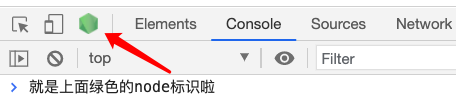
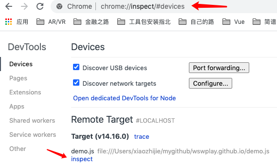

## Mac无法成功设置版本
**nvm alias default x.x.x 设置默认版本，一直不成功，一直显示的是system。**    
system 版本应该是使用 brew 安装之后产生的。在终端里执行下面的命令，进行清除即可。
```bash
sudo rm -rf /usr/local/{lib/node{,/.npm,_modules},bin,share/man}/{npm*,node*,man1/node*}
```

## 本地调试
### --inspect-brk
1. 使用 --inspect-brk=host:port 标志启动远端服务器内的 inspector 调试器
```bash
node --inspect-brk xxx.js
```
命令行，会出现如下信息
```bash
Debugger listening on ws://127.0.0.1:9229/a06e74fe-603d-4c6c-8609-4a4128968ed9
For help, see: https://nodejs.org/en/docs/inspector
```
这是启用了 V8 检查器，启动了一个ws服务，默认端口9229，加一个动态生成的UUID, 这时需要一个可以连接该服务的调试客户端。打开chrome的开发者工具页面，如果看到node的绿色图标，点击就可进入调试。    
    
:::tip
如果没有，在chrome的地址栏输入 ```chrome://inspect/#devices```      
可以看到如下图所示，Remote Target 中会有你启动调试的文件，点击inspect
::: 


如果是自定义端口，则点击上图中```Discover network targets```右侧按钮，添加上你的端口即可。

#### 另外一种打开方式
2. 在本地访问 ```http://[host:port]/json/list``` 得到 ```devtoolsFrontendUrl```。
3. 本地访问 ```devtoolsFrontendUrl``` 得到调试界面。

