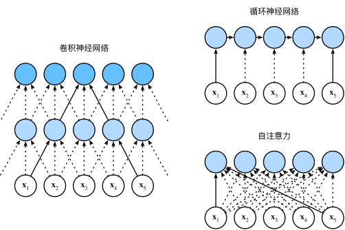
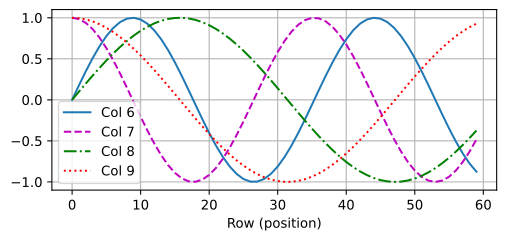

# 注意力机制(attention mechanisms)

## 查询、键和值

在注意力机制的背景下，**自主性提示**被称为**查询（query）**。

给定任何查询，注意力机制通过注意力汇聚（`attention pooling`） 将选择引导至感官输入（`sensory inputs`，例如中间特征表示）。这些感官输入被称为**值（value）**。

每个**值**都与一个**键**（`key`）配对，这可以想象为感官输入的**非自主提示**。

## 注意力机制

“是否包含自主性提示”将**注意力机制**与**全连接层或汇聚层**区别开来。

| 特性           | 注意力机制       | 全连接层       | 汇聚层         |
| -------------- | ---------------- | -------------- | -------------- |
| **参数化**     | 是（动态权重）   | 是（静态权重） | 否（固定规则） |
| **自主性提示** | ✅ 动态适应输入  | ❌ 静态处理    | ❌ 静态处理    |
| **输入依赖性** | 高度依赖         | 不依赖         | 不依赖         |
| **典型应用**   | Transformer, NLP | 传统分类模型   | CNN 的空间降维 |

通过**注意力汇聚**将**查询**（自主性提示）和**键**（非自主性提示）结合在一起，实现对**值**（感官输入）的**选择**倾向（智能选择）。

### 注意力汇聚(attention pooling)

查询（自主提示）和键（非自主提示）之间交互形成**注意力汇聚**，注意力汇聚有选择地**聚合值**（感官输入）以生成最终输出。

**平均汇聚**忽略了键的作用，不够聪明。因此根据查询和键相对**位置加权**，是一个更好的想法。

$$
f(x) = \sum_{i=1}^n \frac{K(x - x_i)}{\sum_{j=1}^n K(x - x_j)} y_i
$$

其中$K$是核(kernel)，公式所描述的估计器被称为 **Nadaraya-Watson 核回归**(Nadaraya-Watson kernel regression)。

受此启发，可以写一个更加通用的注意力汇聚<sup>attention pooling</sup>公式：

$$
f(x) = \sum_{i=1}^n \alpha(x, x_i) y_i
$$

其中$x$是查询，($x_i, y_i$)是键值对。将查询$x$和键$x_i$之间关系建模为注意力权重$\alpha(x,x_i)$，这个权重将被分配给每一个对应值$y_i$。

下面考虑一个高斯核<sup>Gaussian kernel</sup>，其定义为：

$$
\boldsymbol{K}(u) = \frac{1}{\sqrt{2\pi}} \exp(-\frac{u^2}{2})
$$

代入高斯核，并推导公式：

$$
\begin{align*}
f(x) &= \sum_{i=1}^n \alpha(x, x_i) y_i \\
&= \sum_{i=1}^n \frac{\exp\left(-\frac{1}{2}(x - x_i)^2\right)}{\sum_{j=1}^n \exp\left(-\frac{1}{2}(x - x_j)^2\right)} y_i \\
&= \sum_{i=1}^n \text{softmax}\left(-\frac{1}{2}(x - x_i)^2\right) y_i.
\end{align*}
$$

如上可知，一个键$x_i$越接近查询$x$，这个键注意力权重就越大，就获得更多注意力。

:::tip
**越接近、越相似、权重越高**。“查询-键”对**越近**，注意力汇聚**注意力权重**就越高。
:::

### 注意力评分函数

上面使用高斯核对**查询和键**之间**关系建模**，高斯核**指数部分**视为注意力评分函数，简称**评分函数**(scoring function)。

| 评分函数       | 计算方式                         | 适用场景                               |
| -------------- | -------------------------------- | -------------------------------------- |
| **高斯核**     | $\exp(-\|q - k\|^2 / 2\sigma^2)$ | 局部相关性、空间或时间连续性           |
| **点积**       | $q \cdot k$                      | 查询和键维度相同，高维向量，效率优先   |
| **加性注意力** | $v^T \tanh(W_q q + W_k k)$       | 查询和键维度不同，复杂关系，可学习交互 |
| **余弦相似度** | $\frac{q \cdot k}{\|q\|\|k\|}$   | 方向相似性（忽略向量长度）             |

缩放点积注意力(Scaled Dot-Product Attention)公式：

$$
\text{score}(q, k) = \frac{q \cdot k}{\sqrt{d_k}}
$$

**Transformer** 默认**缩放点积注意力**，主要基于**计算效率、理论合理性和实践效果**综合考量。

### key 相同时权重均匀分布

当所有的键（Key）相同时，计算出的注意力权重会均匀分布。所以**键是决定性因素**。

**详细解释**

1. **注意力权重的计算过程**：

- 假设我们有一组查询 $Q$ 和一组键 $K$。对于每一个查询 $q_i$，我们计算它与所有键 $k_j$ 的相似度（通常通过点积或其他相似度度量）。
- 然后，对这些相似度进行 softmax 操作，得到注意力权重 $\alpha_{ij}$ ：

$$
\alpha_{ij} = \frac{\exp(q_i \cdot k_j)}{\sum_{j'} \exp(q_i \cdot k_{j'})}
$$

- 这些权重表示在生成输出时，每个值 $v_j$ 的重要性。

2. **所有键相同的情况**：

- 如果所有的键 $k_j$ 都相同，即 $k_1 = k_2 = \dots = k_n = k$，那么对于任意查询 $q_i$：

$$
q_i \cdot k_j = q_i \cdot k \quad \text{对于所有的} \ j
$$

- 因此，所有的相似度 $q_i \cdot k_j$ 都相同，假设这个相同的值为 $s$。
- 计算 softmax 时：

$$
\alpha_{ij} = \frac{\exp(s)}{\sum_{j'} \exp(s)} = \frac{\exp(s)}{n \cdot \exp(s)} = \frac{1}{n}
$$

- 因此，所有的注意力权重 $\alpha_{ij}$ 都等于 $\frac{1}{n}$，即均匀分布。

3. **直观理解**：

- 键的作用是为查询提供“应该关注哪些部分”的信息。如果所有的键都相同，那么查询无法区分哪些部分更重要，因此只能均匀地关注所有的部分。
- 类似于在人群中，如果所有人的声音完全相同，你无法区分谁在说什么，只能平均听取所有人的意见。

**实例演示**

假设：

- 查询 $q = [1, 0]$。
- 键 $k_1 = k_2 = k_3 = [1, 1]$。
- 计算点积：
  $$
  q \cdot k_j = 1 \cdot 1 + 0 \cdot 1 = 1 \quad \text{对于所有的} \ j
  $$
- 计算 softmax：
  $$
  \alpha_j = \frac{\exp(1)}{\exp(1) + \exp(1) + \exp(1)} = \frac{e}{3e} = \frac{1}{3}
  $$
- 因此，注意力权重为 $[\frac{1}{3}, \frac{1}{3}, \frac{1}{3}]$，即均匀分布。

**可能的误区**

1. **查询的作用**：

- 有人可能会认为查询的不同会影响权重，但实际上如果键相同，无论查询如何，相似度都是相同的（因为 $q \cdot k$ 对所有 $k$ 相同）。
- 只有在键不同时，查询的不同才会导致不同的相似度。

2. **softmax 的性质**：

- softmax 对相同的输入值会输出均匀分布。这是 softmax 的一个基本性质。
- 如果输入到 softmax 的所有值相同，输出就是均匀的。

## 多头注意力(multihead attention)

在实践中，当给定相同的查询、键和值的集合时，我们希望模型可以基于相同的注意力机制学习到不同的行为，然后将不同的行为作为知识组合起来，捕获序列内各种范围的依赖关系（例如，短距离依赖和长距离依赖关系）。

因此，允许注意力机制**组合查询**、键和值的**不同子空间**表示<sup>representation subspaces</sup>可能是有益的。

与其只使用单独一个注意力汇聚， 我们可以用独立学习得到的 $h$ 组不同的**线性投影**（`linear projections`）来变换**查询、键和值**。然后，这 $h$ 组变换后的查询、键和值将并行地送到注意力汇聚中。最后，将这 $h$ 个注意力汇聚的输出**拼接**在一起，并且通过另一个可以学习的线性投影进行变换，以产生最终输出。这种设计被称为**多头注意力（multihead attention）**。

对于 $h$ 个注意力汇聚输出，**每一个注意力汇聚**都被称作**一个头（head）**。

### 代码实现

在实现过程中通常选择**缩放点积注意力**，作为每一个注意力头。

```py
import math
import torch
from torch import nn
from d2l import torch as d2l

class MultiHeadAttention(nn.Module):
  def __init__(self, key_size, query_size, value_size, num_hiddens,
                num_heads, dropout, bias=False, **kwargs):
    super(MultiHeadAttention, self).__init__(**kwargs)
    self.num_heads = num_heads
    self.attention = d2l.DotProductAttention(dropout)
    self.W_q = nn.Linear(query_size, num_hiddens, bias=bias)
    self.W_k = nn.Linear(key_size, num_hiddens, bias=bias)
    self.W_v = nn.Linear(value_size, num_hiddens, bias=bias)
    self.W_o = nn.Linear(num_hiddens, num_hiddens, bias=bias)

  def forward(self, queries, keys, values, valid_lens):
    # queries，keys，values的形状: (batch_size，查询或者“键－值”对的个数，num_hiddens)
    # valid_lens的形状: (batch_size，)或(batch_size，查询的个数)
    # 经过变换后，输出的queries，keys，values　的形状:
    # (batch_size*num_heads，查询或者“键－值”对的个数，num_hiddens/num_heads)
    queries = transpose_qkv(self.W_q(queries), self.num_heads)
    keys = transpose_qkv(self.W_k(keys), self.num_heads)
    values = transpose_qkv(self.W_v(values), self.num_heads)

    if valid_lens is not None:
      # 在轴0，将第一项（标量或者矢量）复制num_heads次，
      # 然后如此复制第二项，然后诸如此类。
      valid_lens = torch.repeat_interleave(valid_lens, repeats=self.num_heads, dim=0)

    # output的形状:(batch_size*num_heads，查询的个数，num_hiddens/num_heads)
    output = self.attention(queries, keys, values, valid_lens)

    # output_concat的形状:(batch_size，查询的个数，num_hiddens)
    output_concat = transpose_output(output, self.num_heads)
    return self.W_o(output_concat)


# 先降维拆分：为了多注意力头的并行计算而变换形状
def transpose_qkv(X, num_heads):
  # 输入X的形状:(batch_size，查询或者“键－值”对的个数，num_hiddens)
  # 输出X的形状:(batch_size，查询或者“键－值”对的个数，num_heads，num_hiddens/num_heads)
  X = X.reshape(X.shape[0], X.shape[1], num_heads, -1)

  # 输出X的形状:(batch_size，num_heads，查询或者“键－值”对的个数，num_hiddens/num_heads)
  X = X.permute(0, 2, 1, 3)

  # 最终输出的形状:(batch_size*num_heads，查询或者“键－值”对的个数，num_hiddens/num_heads)
  return X.reshape(-1, X.shape[2], X.shape[3])

# 再升维融合：逆转transpose_qkv函数的操作
def transpose_output(X, num_heads):
  X = X.reshape(-1, num_heads, X.shape[1], X.shape[2])
  X = X.permute(0, 2, 1, 3)
  return X.reshape(X.shape[0], X.shape[1], -1)

# 实例实用
num_hiddens, num_heads = 100, 5
attention = MultiHeadAttention(num_hiddens, num_hiddens, num_hiddens,
                               num_hiddens, num_heads, 0.5)
attention.eval()

batch_size, num_queries = 2, 4
num_kvpairs, valid_lens =  6, torch.tensor([3, 2])
X = torch.ones((batch_size, num_queries, num_hiddens))
Y = torch.ones((batch_size, num_kvpairs, num_hiddens))
attention(X, Y, Y, valid_lens).shape
# torch.Size([2, 4, 100])
```

## 自注意力(self-attention)

### 定义

将词元序列输入**注意力池化**中，以便**同一组词元同时充当**查询、键和值。

即每个查询都会关注所有键－值对并生成一个注意力输出。由于**查询、键和值来自同一组输入**，被称为**自注意力**（`self-attention`），或**内部注意力**（`intra-attention`）。

```py {8}
num_hiddens, num_heads = 100, 5
attention = d2l.MultiHeadAttention(num_hiddens, num_hiddens, num_hiddens,
                                   num_hiddens, num_heads, 0.5)
attention.eval()

batch_size, num_queries, valid_lens = 2, 4, torch.tensor([3, 2])
X = torch.ones((batch_size, num_queries, num_hiddens))
attention(X, X, X, valid_lens).shape
# torch.Size([2, 4, 100])
```

### 计算细节

A：先看**向量**怎么计算，再看**矩阵**怎么计算。

**第一步**：创建各向量

如上，$W$ 是已训练好的权重矩阵，与`Thinking`词向量 $X_1$操作：

- 乘以 $W^Q$ 得到 $q_1$ 就是`Query`向量
- 乘以 $W^K$ 得到 $k_1$ 就是`Key`向量
- 乘以 $W^V$ 得到 $v_1$ 就是`Value`向量

**第二步**：**点积**计算注意力分数(Attention Score)

根据`Thinking`这个词，对句中其他每个词都计算一个分数。这些分数决定在编码`Thinking`时，需要对句子中其他位置每个词放置多少注意力。

即：通过计算`Thinking`对应**Query**向量，和其他位置每个词**Key**向量**点积**得到。

第一个位置单词`Thinking`的`Attention Score`第一个分数就是 $q_1 \cdot k_1$，第二个分数就是 $q_1 \cdot k_2$。以此类推。

::: tip 缩放点积注意力(Scaled Dot-Product Attention)公式：

$$
\text{score}(q, k) = \frac{q \cdot k}{\sqrt{d_k}}
$$

:::

**第三步**：**缩放**

把每个分数除以 `8`(8 是指 Key 向量的长度的平方根，这里 Key 向量的长度是 64)。也可除以其他数，除以一个数是为了在反向传播时，求取梯度更加稳定。


**第四步**：Softmax 归一化

把这些分数经过一个`Softmax`层，将分数归一化，这样使得分数都是正数并且加起来等于`1`。

这些分数决定了在编码当前位置（这里的例子是第一个位置）的词时，对所有位置的词分别有多少的注意力。很明显，当前位置（这里的例子是第一个位置）的词会有最高的分数，但有时，关注到其他位置上相关的词也很有用。

**第五步**：与**Value**向量相乘。得到每个位置的分数后，将每个分数分别与每个`Value`向量相乘。这种做法背后的直觉理解就是：对于分数高的位置，相乘后的值就越大，我们把更多的注意力放到了它们身上；对于分数低的位置，相乘后的值就越小，这些位置的词可能是相关性不大的，这样我们就忽略了这些位置的词。


**第六步**：结果向量**相加**。把上一步得到的向量相加，就得到了`self-attention`层在这个位置（这里的例子是第一个位置）的输出。

B：**矩阵计算 Self-Attention**


**第一步**：计算Query, Key, and Value 矩阵，把所有输入向量放到 $X$ 矩阵中，将其乘以我们已训练好的权重矩阵($W^Q、W^K、W^V$)。


**搞定**，因为使用矩阵处理，所以把第2步到第6步压缩为一个计算公式，直接得到输出。

### 与 CNN、RNN 比较


**目标**：把 $n$ 个词元序列映射到另一个长度相等序列，每个输入输出词元都是 $d$ 维向量。

**CNN(卷积神经网络)**：

- 设卷积核大小 $k$，序列长度 $n$，输入输出通道数 $d$，卷积层**计算复杂度**为 $O(knd^2)$。
- 卷积神经网络是分层的，因有 $O(1)$ 个顺序操作，**最大路径长度**为 $O(n/k)$。

**RNN(循环神经网络)**：

- 更新循环神经网络隐状态时，$d \times d$ 权重矩阵和 $d$ 维隐状态乘法计算复杂度为 $O(d^2)$，序列长度为 $n$ ，因此**计算复杂度**为 $O(nd^2)$。
- 有 $O(n)$ 个顺序操作无法并行化，**最大路径长度**为 $O(n)$。

**自注意力**：

- 查询、键和值都是 $n \times d$ 矩阵，考虑缩放点积注意力，$n \times d$ 矩阵乘以 $d \times n$ 矩阵。之后输出的 $n \times n$ 矩阵乘以 $n \times d$ 矩阵，**计算复杂度**为 $O(n^2d)$。
- 每个词元都通过自注意力直接连接到任何其他词元，有 $O(1)$ 个顺序操作可以并行计算，**最大路径长度**也是 $O(1)$。

**结论**：卷积神经网络和**自注意力**都拥有**并行计算**优势，且自注意力**最大路径长度最短**。但是因为自注意力计算复杂度是关于序列长度的二次方，所以在很**长序列**中计算会**非常慢**。

## 位置编码

在处理词元序列时，循环神经网络是逐个的重复地处理词元的，而自注意力则因为并行计算而放弃了**顺序操作**。

为了使用序列的顺序信息，通过在输入表示中添加**位置编码**（`positional encoding`）来注入**绝对或相对位置信息**。位置编码可以通过**学习得到**也可以**直接固定**得到。

下面介绍<span style="color: #f00">**固定位置编码**</span>：

假设输入 $\mathbf{X} \in \mathbb{R}^{n \times d}$ 包含一个序列中 $n$ 个词元 $d$ 维嵌入表示。**位置编码**使用相同形状的位置嵌入矩阵 $\mathbf{P} \in \mathbb{R}^{n \times d}$ 输出 $\mathbf{X + P}$。

在位置嵌入矩阵 $\mathbf{P}$ 中，行代表词元在序列中的位置，列代表位置编码的不同维度。相关位置如下：

矩阵第 $i$ 行、第 $2j$ 列的元素：

$$
p_{i,2j} = \sin\left(\frac{i}{10000^{2j/d}}\right)
$$

矩阵第 $i$ 行、第 $2j+1$ 列的元素：

$$
p_{i,2j+1} = \cos\left(\frac{i}{10000^{2j/d}}\right)
$$

**代码实现**如下：

```py
import math
import torch
from torch import nn
from d2l import torch as d2l

# 位置编码
class PositionalEncoding(nn.Module):
  def __init__(self, num_hiddens, dropout, max_len=1000):
    super(PositionalEncoding, self).__init__()
    self.dropout = nn.Dropout(dropout)
    # 创建一个足够长的P
    self.P = torch.zeros((1, max_len, num_hiddens))
    X = torch.arange(max_len, dtype=torch.float32).reshape(
        -1, 1) / torch.pow(10000, torch.arange(
        0, num_hiddens, 2, dtype=torch.float32) / num_hiddens)
    self.P[:, :, 0::2] = torch.sin(X)
    self.P[:, :, 1::2] = torch.cos(X)

  def forward(self, X):
    X = X + self.P[:, :X.shape[1], :].to(X.device)
    return self.dropout(X)

# Go!
encoding_dim, num_steps = 32, 60
pos_encoding = PositionalEncoding(encoding_dim, 0)
pos_encoding.eval()
X = pos_encoding(torch.zeros((1, num_steps, encoding_dim)))
P = pos_encoding.P[:, :X.shape[1], :]
d2l.plot(torch.arange(num_steps), P[0, :, 6:10].T, xlabel='Row (position)',
         figsize=(6, 2.5), legend=["Col %d" % d for d in torch.arange(6, 10)])
```


**效果如图**：可以看到位置嵌入矩阵第 6、7 列和**频率高于**第 8、9 列。

点解？在**二进制**表示中，较高比特位的**交替频率**低于较低比特位。

```py
for i in range(8):
  print(f'{i}的二进制是：{i:>03b}')

# 0的二进制是：000
# 1的二进制是：001
# 2的二进制是：010
# 3的二进制是：011
# 4的二进制是：100
# 5的二进制是：101
# 6的二进制是：110
# 7的二进制是：111
```

打印 (0、1、...、7) 的二进制表示形式，可以看到：每 1 个数字、每 2 个数字和每 4 个数字上的比特值在第 1 个最低位、第 2 个最低位和第 3 个最低位上**分别交替 0 和 1**。
