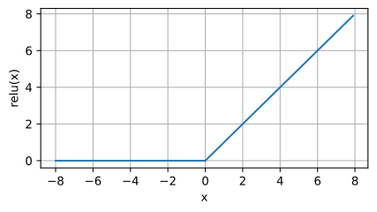
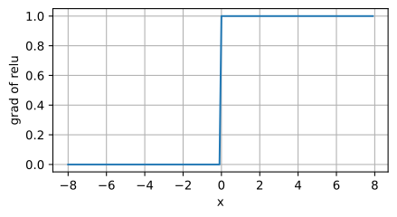

# 基本概念

## 术语

**训练集**：在机器学习的术语中，该数据集称为训练数据集(`training data set`) 或训练集(`training set`)。

**样本**：每行数据(比如一次房屋交易相对应的数据)称为样本(`sample`)， 也可以称为数据点(`data point`)或数据样本(`data instance`)。

**目标/标签**：我们把试图预测的目标(比如预测房屋价格)称为标签(`label`)或目标(`target`)。

**特征**：预测所依据的自变量(面积和房龄)称为特征(`feature`)或协变量(`covariate`)。

## 形态

- **欠拟合**：这些曲线之间的差距很小，验证损失从未增加，因此网络拟合不足的可能性比拟合过度的可能性更大。如果真是这样的话，那就值得试验更多的容量。

- **过拟合**：现在，验证损失很早就开始增加，而训练损失继续减少。这表明网络已经开始过度填充。在这一点上，我们需要尝试一些措施来防止它，要么减少单位数量，要么通过提前停止等方法。

- **提前停止**：一旦开始过拟合，早期停止回调确实停止了训练。此外，通过包括 `restore_best_weights`，我们仍然可以将模型保持在验证损失最低的位置。

## 仿射变换

**仿射变换**（`affine transformation`），特点是通过`加权`和对特征进行`线性变换`（linear transformation）， 并通过`偏置项`来进行平移（`translation`）。

## 从线性回归到深度网络


线性回归是一个**单层神经网络**，层数为 1。我们可以将线性回归模型视为仅由单个人工神经元组成的神经网络，或称为单层神经网络。

对于线性回归，每个输入都与每个输出（在本例中只有一个输出）相连，称为全连接层（fully-connected layer）或称为稠密层（dense layer）。

## 多层感知机(MLP)

线性意味着单调假设，可能会出错。我们可以通过在网络中加入一个或多个**隐藏层**来克服线性模型的限制， 使其能处理更普遍的函数关系类型。对于深度神经网络，我们使用观测数据来联合学习隐藏层表示和应用于该表示的线性预测器。


我们可以通过在网络中加入一个或多个隐藏层来克服线性模型的限制， 使其能处理更普遍的函数关系类型。 要做到这一点，最简单的方法是将许多全连接层堆叠在一起。 每一层都输出到上面的层，直到生成最后的输出。 我们可以把前层看作表示，把最后一层看作线性预测器。 这种架构通常称为多层感知机（`multilayer perceptron`），通常缩写为`MLP`。

为了发挥多层架构的潜力，我们还需要一个额外的关键要素：在仿射变换之后对每个隐藏单元应用**非线性**的**激活函数（activation function）**。激活函数的输出被称为活性值（activations）。一般来说，有了激活函数，就不可能再将我们的多层感知机退化成线性模型。

### 激活函数

激活函数（`activation function`）通过计算加权和并加上偏置来确定神经元是否应该被激活， 它们将输入信号转换为输出的可微运算。

#### ReLU

最受欢迎的激活函数是修正线性单元（`Rectified linear unit`，**ReLU**），因为它实现简单，同时在各种预测任务中表现良好。ReLU 提供了一种非常简单的非线性变换。

给定元素`x`，`ReLU`函数被定义为该元素与 0 的最大值：`ReLU(x) = max(x, 0)`。

```python
import torch
from d2l import torch as d2l

x = torch.arange(-8.0, 8.0, 0.5, requires_grad=True)
y = torch.relu(x)
d2l.plot(x.detach(), y.detach(), 'x', 'relu(x)', figsize=(5, 2.5))
```



`当输入为负时，ReLU 函数的导数为 0`，`而当输入为正时，ReLU 函数的导数为 1`。 注意，当输入值精确等于 0 时，ReLU 函数不可导。 在此时，我们默认使用左侧的导数，即当输入为 0 时导数为 0。 我们可以忽略这种情况，因为输入可能永远都不会是 0。 这里引用一句古老的谚语，“**如果微妙的边界条件很重要，我们很可能是在研究数学而非工程**”， 这个观点正好适用于这里。 下面我们绘制 ReLU 函数的导数。

```python
y.backward(torch.ones_like(x), retain_graph=True)
d2l.plot(x.detach(), x.grad, 'x', 'grad of relu', figsize=(5, 2.5))
```



使用 ReLU 的原因是，它求导表现得特别好：**要么让参数消失，要么让参数通过**。 这使得优化表现得更好，并且 ReLU 减轻了困扰以往神经网络的**梯度消失**问题。

在 PyTorch 的反向传播过程中，使用 `torch.ones_like(x)` 是为了方便地计算标量损失的梯度。在反向传播时，初始的梯度是用来告诉 PyTorch 如何从标量开始传播梯度。

**为什么使用 `torch.ones_like(x)`？**

1. **默认行为**:

   - 如果 `y` 是一个标量（单个值），调用 `y.backward()` 时，默认会传递一个值为 1 的梯度，意思是对 `y` 本身的梯度为 1，这符合链式法则。
   - 如果 `y` 是非标量（例如一个向量或矩阵），则需要你指定对每个元素的梯度权重，这就是为什么传入 `torch.ones_like(x)`，它为每个元素都传入 1。

2. **梯度传递**:

   - 使用 1 表示你想要计算 `y` 对 `x` 的真实梯度。因为链式法则中的乘法会逐步传播梯度，所以对标量输出的梯度为 1 是最直观的，表示不改变梯度大小，只传播真实的梯度。

3. **最常见的场景**:
   - 这种用法最常见的场景是当你在计算一个损失函数时，损失通常是标量，例如交叉熵损失或均方误差损失。在这种情况下，损失相对于模型参数的梯度自然就是相对于标量的梯度，即 1。

#### sigmoid

对于一个定义域在 `R` 中的输入， `sigmoid` 函数将输入变换为区间(0, 1)上的输出。 `因此，sigmoid` 通常称为**挤压函数（squashing function）**: 它将范围`（-inf, inf）`中的任意输入压缩到区间`（0, 1）`中的某个值。

在最早的神经网络中，科学家们感兴趣的是对“激发”或“不激发”的生物神经元进行建模。 因此，这一领域的先驱可以一直追溯到人工神经元的发明者麦卡洛克和皮茨，他们专注于阈值单元。 阈值单元在其输入低于某个阈值时取值 0，当输入超过阈值时取值 1。

当我们想要将输出视作二元分类问题的概率时， sigmoid 仍然被广泛用作输出单元上的激活函数，后面关于循环神经网络的章节中，我们将描述利用 sigmoid 单元来控制时序信息流的架构。

当输入接近 0 时，sigmoid 函数接近线性变换。（`sigmoid` 可以视为 `softmax` 的特例）

```python
y = torch.sigmoid(x)
d2l.plot(x.detach(), y.detach(), 'x', 'sigmoid(x)', figsize=(5, 2.5))
```


#### tanh

与 `sigmoid` 函数类似，`tanh(双曲正切)`函数也能将其输入压缩转换到区间`(-1, 1)`上。当输入在 0 附近时，tanh 函数接近线性变换。 函数的形状类似于 sigmoid 函数， 不同的是 tanh 函数关于坐标系原点中心对称。

```python
y = torch.tanh(x)
d2l.plot(x.detach(), y.detach(), 'x', 'tanh(x)', figsize=(5, 2.5))
```


### 向前传播

前向传播（`forward propagation 或 forward pass`） 指的是：按**顺序**（从输入层到输出层）**计算和存储**神经网络中每层的**结果**。

### 反向传播

反向传播（`backward propagation 或 backpropagation`）指的是计算神经网络参数**梯度**的方法。 简言之，该方法根据**微积分**中的链式规则，按**相反的顺序**从输出层到输入层遍历网络。 该算法存储了计算某些参数梯度时所需的**任何中间变量（偏导数）**。

### 训练神经网络

因此，在训练神经网络时，在初始化模型参数后， 我们**交替使用**前向传播和反向传播，利用反向传播给出的梯度来更新模型参数。 注意，反向传播重复利用前向传播中存储的中间值，以避免重复计算。 带来的影响之一是我们需要保留中间值，直到反向传播完成。 这也是训练比单纯的预测需要更多的内存（显存）的原因之一。 此外，这些中间值的大小与网络层的数量和批量的大小大致成正比。 因此，使用更大的批量来训练更深层次的网络更容易导致内存不足（`out of memory`）错误。

### 小结

- 前向传播在神经网络定义的计算图中按顺序计算和存储中间变量，顺序是从输入层到输出层。
- 反向传播按相反顺序（从输出层到输入层），计算和存储中间变量和参数的梯度。
- 在训练深度学习模型时，前向传播和反向传播是相互依赖的。
- 训练比预测需要更多的内存。

## 卷积层

### 卷积核

在一个卷积层中，**卷积核的数量可以有多个**，通常取决于该卷积层的设计和模型的需求。具体地说，卷积层中的卷积核数量与该层输出的**特征图**(`feature maps`)数量直接相关。

- **每个卷积核产生一个特征图**：每个卷积核通过在输入图像（或输入特征图）上滑动，执行卷积运算，生成一个特征图。卷积核的数量通常决定了该卷积层输出的特征图的数量。
- **多个卷积核**：一个卷积层可以有多个卷积核。例如，如果某个卷积层有 32 个卷积核，那么它就会输出 32 个特征图。这些特征图捕捉了输入图像的不同特征（如边缘、纹理、模式等）。

- **与输出通道数相关**：在卷积神经网络（CNN）中，卷积层的**输出通道数**决定了卷积核的数量。假设输入数据有 \( C \) 个通道（例如，彩色图像有 3 个通道，即红、绿、蓝通道），而卷积层的输出通道数为 \( K \)，那么该卷积层就会有 \( K \) 个卷积核。

总结来说，一个卷积层可以有多个卷积核，通常这个数量与该层的**输出通道数**相等，并且每个卷积核生成一个对应的特征图。

在深度学习研究社区中，V 被称为卷积核（`convolution kernel`）或者滤波器（`filter`），亦或简单地称之为该**卷积层的权重**，通常**该权重是可学习**的参数。

### 感受野

在卷积神经网络中，对于某一层的任意元素，其感受野（`receptive field`）是指在前向传播期间可能影响计算的所有元素（`来自所有先前层`）。

### 可视化

众所周知，深度学习仍是一个黑盒子，模型内部的逻辑含义仍旧无法解释，越是未知的东西，越能激起人们的好奇心。在卷积神经网络中，有时会对卷积核以及特征图进行可视化，以此观察卷积神经网络学习到了何种模式。

用 `TensorBoard` 实现可视化。

- python 代码中将可视化的数据记录到 `event file` 中，保存至硬盘。
- 采用 `tensorboard` 对 `event file` 文件进行读取，并在 `web` 端进行可视化。

```bash
# 先运行目标python文件，生成 event file
python xxx.py
# 在目标文件夹内启动命令
tensorboard --logdir=your_path_dir
# 打开浏览器 http://localhost:6006/
```

## 正则化技术

**正则化（regularization）** 这个名字来源于其核心作用，即对模型进行“**规则化**”或者“**规范化**”，让模型在复杂数据上保持一定的约束，防止它过于灵活而产生过拟合。

### 背景：

在机器学习或统计建模中，模型的复杂度是一个关键问题。如果模型过于复杂，它可能在训练数据上表现得非常好（即训练误差很低），但在测试数据或未见过的新数据上表现不佳（泛化能力差）。这种情况就是**过拟合（overfitting）**。

为了应对这种情况，**正则化技术** 被引入，它通过引入一些**额外的约束或惩罚项**来限制模型的复杂度，从而提高模型的泛化能力。正则化的核心思想是让模型不仅要在训练数据上拟合得好，还要保持适当的简洁性和稳定性。

### 为什么叫“正则化”？

“**正则化**”一词的意思可以理解为对模型的学习过程施加“**规则**”或“**规范**”。具体来说：

1. **规则化模型**：正则化通过引入额外的约束（如 L1、L2 惩罚项，或 Dropout 等方法），让模型的参数不能过大或过于自由，这样可以避免模型对训练数据的过度拟合，确保模型能够推广到新的数据上。这种过程相当于对模型的参数进行“规范化”或“约束化”。
2. **防止过度复杂**：正则化方法使得模型在复杂度和拟合度之间找到一个平衡点，而不是在训练集上做出过于复杂的拟合行为。它“**正则**”了模型，避免了模型的任意复杂化。

### 常见的正则化方法：

- **L1 正则化（Lasso）**：通过添加参数绝对值的惩罚项，迫使部分参数变为零，从而产生稀疏模型，减少模型复杂度。
- **L2 正则化（Ridge）**：通过添加参数平方和的惩罚项，使得参数值趋向较小，从而控制模型的复杂度。
- **Dropout**：通过在训练时随机丢弃部分神经元，避免网络对某些特定神经元的过度依赖，提高模型的泛化能力。
- **数据增强**：通过增加训练数据的多样性，正则化了模型对数据的理解，避免对特定模式的过拟合。

### 总结：

“正则化”这个名字反映了其对模型进行约束、规则化的过程，防止模型过于复杂，从而提升模型的泛化能力。正则化的目的就是在拟合训练数据的同时，确保模型能够处理未见过的测试数据，实现更好的泛化性能。
