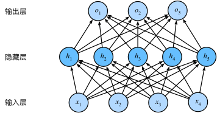
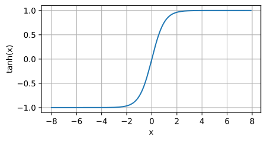

<SpeechButton />

# 基本概念

## 术语

**训练集**：在机器学习的术语中，该数据集称为训练数据集(`training data set`) 或训练集(`training set`)。

**样本**：每行数据(比如一次房屋交易相对应的数据)称为样本(`sample`)， 也可以称为数据点(`data point`)或数据样本(`data instance`)。

**目标/标签**：我们把试图预测的目标(比如预测房屋价格)称为标签(`label`)或目标(`target`)。

**特征**：预测所依据的自变量(面积和房龄)称为特征(`feature`)或协变量(`covariate`)。

## 形态

- **欠拟合**：这些曲线之间的差距很小，验证损失从未增加，因此网络拟合不足的可能性比拟合过度的可能性更大。如果真是这样的话，那就值得试验更多的容量。

- **过拟合**：现在，验证损失很早就开始增加，而训练损失继续减少。这表明网络已经开始过度填充。在这一点上，我们需要尝试一些措施来防止它，要么减少单位数量，要么通过提前停止等方法。

- **提前停止**：一旦开始过拟合，早期停止回调确实停止了训练。此外，通过包括 `restore_best_weights`，我们仍然可以将模型保持在验证损失最低的位置。

## 仿射变换

**仿射(Affine Transformation)**，即**保持平行关系的映射**。可拆成两个字来理解：“仿” + “射”。

仿，在这里是“类似、仿佛、平行”的意思。它精准地捕捉了 Affine Transformation 最核心的几何特性：**保持平行性**。

射，是数学中“映射”（Mapping）的意思。指的就是一个函数关系，把一个点变成另一个点。所以“射”指明了这是一种变换或**映射**。

`torch.nn.Linear`：特点是通过`加权`和对特征进行`线性变换`（linear transformation）， 并通过`偏置项`来进行平移（`translation`）。

**核心定义：**

仿射变换是线性变换（如旋转、缩放、剪切）和平移变换的复合。它可以理解为在几何中，一个向量空间进行一次**线性变换**后再接上一个**平移**，变换为另一个向量空间。

**通俗理解：**

想象一下一张图片（或一个网格），你对它进行以下所有或部分操作：

1. 缩放（Scaling）：放大或缩小。
2. 旋转（Rotation）：绕着某个点转动。
3. 剪切（Shearing）：让图形像平行四边形一样被拉斜。
4. 平移（Translation）：上下左右移动，不进行旋转。

把这些操作合在一起，就是仿射变换。它有一个最重要的特性：**保持“平直性”与“平行性”**。

- 平直性：变换后，原来的直线还是直线，不会变成曲线。
- 平行性：变换后，原来平行的直线仍然保持平行。

**相对概念：**

仿射变换的“相对概念”或“对比概念”通常是指**投影变换（Projective Transformation）**，也称为**单应性变换（Homography）**。这是一个比仿射变换更一般、更复杂的变换。

**小结：**

- **仿射变换**是**投影变换**的一个**子集**。当投影变换矩阵中的 `g = 0, h = 0, i = 1` 时，投影变换就退化成了仿射变换。
- 最根本的区别在于：**仿射变换保持平行线依然平行，而投影变换不保持**。投影变换引入了“近大远小”的透视感，而这正是仿射变换所没有的。

## 从线性回归到深度网络


由于模型重点在**计算**，所以通常我们在**计算层数时不考虑输入层**。

线性回归是一个**单层神经网络**，层数为 1。我们可以将线性回归模型视为仅由单个人工神经元组成的神经网络，或称为单层神经网络。

对于线性回归，每个输入都与每个输出（在本例中只有一个输出）相连，称为全连接层（fully-connected layer）或称为稠密层（dense layer）。

## 多层感知机(MLP)

### 隐藏层

线性意味着单调假设，可能会出错。可以加入一个或多个**隐藏层**(`Hidden Layer`)来克服线性模型限制，使其能处理更普遍的函数关系类型。

:::tip 为何叫隐藏层

- 历史原因：在早期的神经网络研究中，输入层和输出层是直接可观测的（输入数据对应输入层，预测结果对应输出层），而中间的层既不是输入也不是输出，因此被称为“隐藏层”，意为“不可直接观测的中间层”。
- 数学视角：隐藏层的输出是输入数据经过非线性变换后的中间表示（Intermediate Representation），这些表示并非人工设计，而是模型自动学习得到的，因此对使用者而言是“隐藏”的。
  :::

要做到这一点，最简单的方法是将许多全连接层堆叠在一起。每一层都输出到上面的层，直到生成最后的输出。我们可以把前 $L-1$ 层看作**表示**，把最后一层看作**线性预测器**。这种架构通常称为多层感知机（`multilayer perceptron`），通常缩写为`MLP`。



神经网络通过堆叠多个隐藏层，形成**复合函数**：

$$
y = f_L(f_{L-1}(...f_1(\mathbf{x})))
$$

每一层 $f_i$ 对前一层输出进行非线性变换，逐步构建更复杂的表示。

**举个栗子：图像分类任务**

1. **输入层**：原始像素（如 224×224×3 的 RGB 值）。
2. **第一隐藏层**：检测边缘（通过卷积核响应）。
3. **中间隐藏层**：组合边缘为局部形状（如圆形、方形）。
4. **深层隐藏层**：识别物体部件（如车轮、猫耳）。
5. **输出层**：综合高级特征预测类别（“猫”或“狗”）。

为了发挥多层架构的潜力，我们还需要一个额外的关键要素：在仿射变换之后对每个隐藏单元应用**非线性**的**激活函数（activation function）**。激活函数的输出被称为活性值（activations）。非线性激活函数提供空间扭曲能力，将数据映射到**更易分离或更高维**的**新空间**。例如将二维数据通过 $(x, y) \rightarrow (x^2, y^2, xy)$ 映射到三维，可能更容易用超平面分类。

一般来说，有了激活函数，就不可能再将我们的多层感知机退化成线性模型。

**Pytorch 中 nn.Linear 隐藏层(升维 or 降维)**

```py
# 升维示例
import torch

# 查询形状: (1, 2, 3)
queries = torch.tensor(
  [
    [[1.0, 2.0, 3.0],  # 第一个位置
    [4.0, 5.0, 6.0]]   # 第二个位置
  ]
)

# 权重矩阵
query_size, num_hiddens = 3, 5
W_q = nn.Linear(query_size, num_hiddens, bias=False)
print(W_q.weight.shape)  # 输出: torch.Size([5, 3])
# 假设权重值为:
W_q.weight = torch.tensor(
  [
    [0.1, 0.2, 0.3],  # 输出维度0的权重
    [0.4, 0.5, 0.6],  # 输出维度1
    [0.7, 0.8, 0.9],  # 输出维度2
    [1.0, 1.1, 1.2],  # 输出维度3
    [1.3, 1.4, 1.5]   # 输出维度4
  ]
)
# 完整输出 torch.Size([2, 5])，3维升级成5维。
output = torch.matmul(queries, W_q.weight.T)
# output[0] = [[1.4, 3.2, 5.0, 6.8, 8.6],   # 第一个位置的5维输出
#             [3.2, 7.7, 12.2, 16.7, 21.2]] # 第二个位置
```

### 激活函数

激活函数（`activation function`）通过计算加权和并加上偏置来确定神经元是否应该被激活， 它们将输入信号转换为输出的可微运算。

#### ReLU

最受欢迎的激活函数是修正线性单元（`Rectified linear unit`，**ReLU**），因为它实现简单，同时在各种预测任务中表现良好。ReLU 提供了一种非常简单的非线性变换。

给定元素 $x$ ，`ReLU`函数被定义为该元素与 0 的最大值：
$$ \text{ReLU}(x) = \max(x, 0) $$

```python
import torch
from d2l import torch as d2l

x = torch.arange(-8.0, 8.0, 0.5, requires_grad=True)
y = torch.relu(x)
d2l.plot(x.detach(), y.detach(), 'x', 'relu(x)', figsize=(5, 2.5))
```


`当输入为负时，ReLU 函数的导数为 0`，`而当输入为正时，ReLU 函数的导数为 1`。 注意，当输入值精确等于 0 时，ReLU 函数不可导。 在此时，我们默认使用左侧的导数，即当输入为 0 时导数为 0。 我们可以忽略这种情况，因为输入可能永远都不会是 0。这里引用一句古老谚语，“**如果微妙的边界条件很重要，我们很可能是在研究数学而非工程**”。

下面我们绘制 ReLU 函数的导数。

```python
y.backward(torch.ones_like(x), retain_graph=True)
d2l.plot(x.detach(), x.grad, 'x', 'grad of relu', figsize=(5, 2.5))
```


使用 ReLU 的原因是，它求导表现得特别好：**要么让参数消失，要么让参数通过**。 这使得优化表现得更好，并且 ReLU 减轻了困扰以往神经网络的**梯度消失**问题。

在 PyTorch 的反向传播过程中，使用 `torch.ones_like(x)` 是为了方便地计算标量损失的梯度。在反向传播时，初始的梯度是用来告诉 PyTorch 如何从标量开始传播梯度。

**为什么使用 `torch.ones_like(x)`？**

1. **默认行为**:

   - 如果 `y` 是一个标量（单个值），调用 `y.backward()` 时，默认会传递一个值为 1 的梯度，意思是对 `y` 本身的梯度为 1，这符合链式法则。
   - 如果 `y` 是非标量（例如一个向量或矩阵），则需要你指定对每个元素的梯度权重，这就是为什么传入 `torch.ones_like(x)`，它为每个元素都传入 1。

2. **梯度传递**:

   - 使用 1 表示你想要计算 `y` 对 `x` 的真实梯度。因为链式法则中的乘法会逐步传播梯度，所以对标量输出的梯度为 1 是最直观的，表示不改变梯度大小，只传播真实的梯度。

3. **最常见的场景**:
   - 这种用法最常见的场景是当你在计算一个损失函数时，损失通常是标量，例如交叉熵损失或均方误差损失。在这种情况下，损失相对于模型参数的梯度自然就是相对于标量的梯度，即 1。

#### sigmoid

对于一个定义域在 `R` 中的输入， `sigmoid` 函数将输入变换为区间(0, 1)上的输出。 `因此，sigmoid` 通常称为**挤压函数（squashing function）**: 它将范围`（-inf, inf）`中的任意输入压缩到区间`（0, 1）`中的某个值。
$$ \text{sigmoid}(x) = \frac{1}{1 + \exp(-x)} $$

在最早的神经网络中，科学家们感兴趣的是对“激发”或“不激发”的生物神经元进行建模。 因此，这一领域的先驱可以一直追溯到人工神经元的发明者麦卡洛克和皮茨，他们专注于阈值单元。 阈值单元在其输入低于某个阈值时取值 0，当输入超过阈值时取值 1。

当我们想要将输出视作二元分类问题的概率时， sigmoid 仍然被广泛用作输出单元上的激活函数，后面关于循环神经网络的章节中，我们将描述利用 sigmoid 单元来控制时序信息流的架构。

当输入接近 0 时，sigmoid 函数接近线性变换。（`sigmoid` 可以视为 `softmax` 的特例）

```python
y = torch.sigmoid(x)
d2l.plot(x.detach(), y.detach(), 'x', 'sigmoid(x)', figsize=(5, 2.5))
```


#### tanh

与 `sigmoid` 函数类似，`tanh(双曲正切)`函数也能将其输入压缩转换到区间`(-1, 1)`上。
$$ \tanh(x) = \frac{1 - \exp(-2x)}{1 + \exp(-2x)} $$

当输入在 0 附近时，tanh 函数接近线性变换。 函数的形状类似于 sigmoid 函数， 不同的是 tanh 函数关于坐标系原点中心对称。

```python
y = torch.tanh(x)
d2l.plot(x.detach(), y.detach(), 'x', 'tanh(x)', figsize=(5, 2.5))
```



### 向前传播

前向传播（`forward propagation 或 forward pass`） 指的是：按**顺序**（从输入层到输出层）**计算和存储**神经网络中每层的**结果**。

### 反向传播

反向传播（`backward propagation 或 backpropagation`）指的是计算神经网络参数**梯度**的方法。 简言之，该方法根据**微积分**中的链式规则，按**相反的顺序**从输出层到输入层遍历网络。 该算法存储了计算某些参数梯度时所需的**任何中间变量（偏导数）**。

### 训练神经网络

因此，在训练神经网络时，在初始化模型参数后， 我们**交替使用**前向传播和反向传播，利用反向传播给出的梯度来更新模型参数。 注意，反向传播重复利用前向传播中存储的中间值，以避免重复计算。 带来的影响之一是我们需要保留中间值，直到反向传播完成。 这也是训练比单纯的预测需要更多的内存（显存）的原因之一。 此外，这些中间值的大小与网络层的数量和批量的大小大致成正比。 因此，使用更大的批量来训练更深层次的网络更容易导致内存不足（`out of memory`）错误。

### 小结

- 前向传播在神经网络定义的计算图中按顺序计算和存储中间变量，顺序是从输入层到输出层。
- 反向传播按相反顺序（从输出层到输入层），计算和存储中间变量和参数的梯度。
- 在训练深度学习模型时，前向传播和反向传播是相互依赖的。
- 训练比预测需要更多的内存。

## 损失函数

### 均方误差(回归问题)

回归问题中的均方误差（`Mean Squared Error, MSE`）是衡量模型**预测值与真实值之间差异**的常用指标。通过 MSE，可以量化模型的预测精度，但需结合其他指标（如 $R^2$、MAE）综合评估。

**1. 核心公式**

MSE 的计算公式为：

$$
\text{MSE} = \frac{1}{n} \sum_{i=1}^{n} (y_i - \hat{y}_i)^2
$$

其中：

- $n$：样本数量。
- $y_i$：第 $i$ 个样本的真实值。
- $\hat{y}_i$：第 $i$ 个样本的预测值。

**2. 计算步骤**

a、 **计算每个样本的误差**：对每个样本，求预测值 $\hat{y}_i$ 与真实值 $y_i$ 的差值（即残差）。

b、 **平方误差**：将每个残差平方，消除正负号的影响并放大较大误差。

c、 **求平均**：将所有平方误差求和后除以样本数量 $n$，得到平均平方误差。

**3. 实例演示**

假设有以下真实值和预测值：

| 样本 | 真实值 $y_i$ | 预测值 $\hat{y}_i$ |
| ---- | ------------ | ------------------ |
| 1    | 5            | 4                  |
| 2    | 3            | 3                  |
| 3    | 8            | 10                 |

计算过程：

a、残差平方：

- $(5-4)^2 = 1$
- $(3-3)^2 = 0$
- $(8-10)^2 = 4$

b、 求和并平均：

$$
\text{MSE} = \frac{1 + 0 + 4}{3} = \frac{5}{3} \approx 1.67
$$

**4. 特点**

- **单位**：MSE 的单位是目标变量的平方（如 $\text{kg}^2$ 若原单位为 $\text{kg}$）。
- **对异常值敏感**：平方操作会放大较大误差的影响。
- **与 RMSE 的关系**：均方根误差（RMSE）是 MSE 的平方根，单位与原数据一致。

**5. Python 实现**

```py
import numpy as np

# 真实值和预测值
y_true = np.array([5, 3, 8])
y_pred = np.array([4, 3, 10])

# 计算 MSE
mse = np.mean((y_true - y_pred) ** 2)
print("MSE:", mse)  # 输出: 1.666...
```

**6. 应用场景**

- **模型评估**：用于比较不同回归模型的性能（MSE 越小，模型越好）。
- **损失函数**：在训练模型时，常作为优化目标（如线性回归的梯度下降）。

### 交叉熵(分类问题)

多分类交叉熵损失函数（`Categorical Cross-Entropy Loss`）是深度学习中用于多分类问题的核心损失函数。以下是其详细计算过程：

**1. 核心公式**

对于单个样本的损失计算：

$$
L = -\sum_{i=1}^{C} y_i \log(p_i)
$$

- $C$：类别总数（如 10 类分类）。
- $y_i$：真实标签的 one-hot 编码（第$i$类为 1，其余为 0）。
- $p_i$：模型对第$i$类的预测概率（通过 Softmax 输出）。

**2. 计算步骤**

**a、模型输出（Logits）**

假设模型最后一层输出为未归一化的**logits**向量（如全连接层输出）：

$$
\mathbf{z} = [z_1, z_2, ..., z_C]
$$

**b、Softmax 归一化**

将 logits 转换为概率分布 $\mathbf{p} = [p_1, p_2, ..., p_C]$：

$$
p_i = \frac{e^{z_i}}{\sum_{j=1}^{C} e^{z_j}}
$$

所有 $p_i \in (0,1)$ 且 $\sum_{i=1}^{C} p_i = 1$。

:::tip
**自然对数底**是惯例，因其与 Softmax 的数学关系紧密，计算高效且梯度简洁。
:::

**c、计算交叉熵**

假设真实类别为第 $k$ 类（即 $y_k=1$，其余 $y_i=0$），损失简化为：

$$
L = -\log(p_k)
$$

即：仅需计算**真实类别**对应的预测**概率的对数**。

**3. 批量样本的损失**

对于批量数据（ $N$ 个样本），通常取平均损失：

$$
L_{\text{batch}} = -\frac{1}{N}\sum_{n=1}^{N}\sum_{i=1}^{C} y_{i}^{(n)} \log(p_{i}^{(n)})
$$

**4. 实例演示**

假设 3 分类问题，某样本实为第 2 类（`one-hot` 为 $\mathbf{y} = [0, 1, 0]$ ），logits 和概率如下：

| 步骤        | 计算过程                                                                 |
| ----------- | ------------------------------------------------------------------------ |
| **Logits**  | $\mathbf{z} = [2.0, 1.0, 0.1]$                                           |
| **Softmax** | $p_1 = \frac{e^{2.0}}{e^{2.0}+e^{1.0}+e^{0.1}} \approx 0.659$            |
|             | $p_2 = \frac{e^{1.0}}{e^{2.0}+e^{1.0}+e^{0.1}} \approx 0.242$            |
|             | $p_3 = \frac{e^{0.1}}{e^{2.0}+e^{1.0}+e^{0.1}} \approx 0.099$            |
| **交叉熵**  | $L = -(0 \cdot \log(0.659) + 1 \cdot \log(0.242) + 0 \cdot \log(0.099))$ |
|             | $L = -\log(0.242) \approx 1.418$                                         |

预测为 1 类，真实为 2 类，模型<span style="color: red">**预测错误**</span>，所以**损失大**。

**5. 关键点**

- **数值稳定性**：实践中为避免 `log(0)`，常对 `Softmax` 概率做裁剪（如 $\max(p_i, \epsilon)$ 其中 $\epsilon=1e-10$ ）。
- **LogSoftmax 技巧**：框架(如 `PyTorch`)常用 `LogSoftmax + NLLLoss`，避免数值下溢。
- **与二分类区别**：多分类交叉熵是二分类的扩展，二分类中可用 `Sigmoid` 替代 `Softmax`。

## 正则化技术

**正则化（regularization）** 这个名字来源于其核心作用，即对模型进行“**规则化**”或者“**规范化**”，让模型在复杂数据上保持一定的约束，防止它过于灵活而产生过拟合。

### 背景

在机器学习或统计建模中，模型的复杂度是一个关键问题。如果模型过于复杂，它可能在训练数据上表现得非常好（即训练误差很低），但在测试数据或未见过的新数据上表现不佳（泛化能力差）。这种情况就是**过拟合（overfitting）**。

为了应对这种情况，**正则化技术** 被引入，它通过引入一些**额外的约束或惩罚项**来限制模型的复杂度，从而提高模型的泛化能力。正则化的核心思想是让模型不仅要在训练数据上拟合得好，还要保持适当的简洁性和稳定性。

### 为什么叫“正则化”

“**正则化**”一词的意思可以理解为对模型的学习过程施加“**规则**”或“**规范**”。具体来说：

1. **规则化模型**：正则化通过引入额外的约束（如 L1、L2 惩罚项，或 Dropout 等方法），让模型的参数不能过大或过于自由，这样可以避免模型对训练数据的过度拟合，确保模型能够推广到新的数据上。这种过程相当于对模型的参数进行“规范化”或“约束化”。
2. **防止过度复杂**：正则化方法使得模型在复杂度和拟合度之间找到一个平衡点，而不是在训练集上做出过于复杂的拟合行为。它“**正则**”了模型，避免了模型的任意复杂化。

### 常见的正则化方法

- **L1 正则化（Lasso）**：通过添加参数绝对值的惩罚项，迫使部分参数变为零，从而产生稀疏模型，减少模型复杂度。
- **L2 正则化（Ridge）**：通过添加参数平方和的惩罚项，使得参数值趋向较小，从而控制模型的复杂度。
- **Dropout**：通过在训练时随机丢弃部分神经元，避免网络对某些特定神经元的过度依赖，提高模型的泛化能力。
- **数据增强**：通过增加训练数据的多样性，正则化了模型对数据的理解，避免对特定模式的过拟合。

### 总结

“正则化”这个名字反映了其对模型进行约束、规则化的过程，防止模型过于复杂，从而提升模型的泛化能力。正则化的目的就是在拟合训练数据的同时，确保模型能够处理未见过的测试数据，实现更好的泛化性能。

## 动态规划

动态规划(`Dynamic Programming: DP`)是一种解决多阶段决策优化问题的方法。通过**将复杂问题分解为子问题**，并**存储子问题的解**（避免重复计算）来提高效率。

**核心思想**：

- **最优子结构**：问题的最优解包含子问题的最优解。
- **重叠子问题**：子问题被重复计算，通过记忆化（缓存）避免重复工作。
- **自底向上或自顶向下**：通常用递推（迭代）或递归+记忆化实现。

**经典应用**：

- 最短路径问题（如 Dijkstra 算法、Floyd-Warshall 算法）
- 背包问题
- 编辑距离（Levenshtein 距离）
- 斐波那契数列优化计算

**示例**：  
计算斐波那契数列时，直接递归时间复杂度为指数级，而动态规划（存储已计算的项）可降至线性时间。

## 马尔可夫链

马尔可夫链(`Markov Chain`)是一种描述**随机状态转移**的数学模型。特点是“无记忆性”（马尔可夫性质），即**下一状态仅依赖当前状态**，与过去无关。

**核心性质**：

- **状态空间**：系统可能处于的离散状态集合（如天气的“晴、雨、阴”）。
- **转移概率矩阵**：状态间转换的概率（如今天晴 → 明天雨的概率）。
- **稳态分布**：长期运行后，系统处于各状态的稳定概率（若存在）。

**经典应用**：

- 自然语言处理（如隐马尔可夫模型 HMM）
- 金融建模（股票价格变动）
- 排队论、网页排序（PageRank 算法）

**示例**：  
预测明天天气时，只需知道今天天气的概率分布，无需考虑更早的历史。

## 格拉姆矩阵(Gram Matrix)

**格拉姆矩阵**<sup>Gram Matrix</sup>是线性代数和机器学习中一个重要的概念，它通过**内积运算**描述向量集合中**两两之间相似性或相关性**。

**定义**：

给定一组向量 $\{\mathbf{v}_1, \mathbf{v}_2, \dots, \mathbf{v}_n\}$（属于向量空间 $V$），格拉姆矩阵 $G$ 是一个 $n \times n$ 的对称矩阵，其元素 $G_{ij}$ 是向量 $\mathbf{v}_i$ 和 $\mathbf{v}_j$ 的内积：

$$
G_{ij} = \langle \mathbf{v}_i, \mathbf{v}_j \rangle
$$

其中 $\langle \cdot, \cdot \rangle$ 表示内积运算（如点积）。

**应用场景**：

- 核方法(Kernel Methods)：在支持向量机（SVM）等算法中，格拉姆矩阵推广为核矩阵<sup>Kernel Matrix</sup>，通过核函数计算高维空间的内积。
- 主成分分析(PCA)：用于协方差矩阵的计算，本质是中心化后的格拉姆矩阵。
- 几何分析：判断向量组的线性相关性或计算夹角（如 $G_{ij} = \|\mathbf{v}_i\| \|\mathbf{v}_j\| \cos\theta$）。
- 深度学习：自注意力机制<sup>Self-Attention</sup>中的相似度矩阵可视为格拉姆矩阵的变体。

**举个例子**：

假设两个向量 $\mathbf{v}_1 = [1, 2]$, $\mathbf{v}_2 = [3, 4]$，其格拉姆矩阵为：

$$
G = \begin{bmatrix}
\langle \mathbf{v}_1, \mathbf{v}_1 \rangle & \langle \mathbf{v}_1, \mathbf{v}_2 \rangle \\
\langle \mathbf{v}_2, \mathbf{v}_1 \rangle & \langle \mathbf{v}_2, \mathbf{v}_2 \rangle
\end{bmatrix}
= \begin{bmatrix}
1 \cdot 1 + 2 \cdot 2 & 1 \cdot 3 + 2 \cdot 4 \\
3 \cdot 1 + 4 \cdot 2 & 3 \cdot 3 + 4 \cdot 4
\end{bmatrix}
= \begin{bmatrix}
5 & 11 \\
11 & 25
\end{bmatrix}
$$

**直观理解**：

格拉姆矩阵压缩了向量组的几何信息：

- 对角线元素是各向量的模长平方。
- 非对角线元素反映向量间的夹角（正交时 $G_{ij}=0$）。

若格拉姆矩阵可逆，则向量线性无关；若奇异，则存在线性相关。

## Softmax 函数

**Softmax 函数**，是一种常用的**归一化函数**。

**核心作用**：将一个**实数向量**(如分类模型原始输出`logits`)转换为一个**概率分布**，使得每个输出值都在`(0, 1)`之间，且所有输出值的和为 1。

**数学定义**：

对于一个输入向量 $\mathbf{z} = [z_1, z_2, ..., z_K]$（$K$ 是类别数），Softmax 第 $i$ 个输出为：

$$
\sigma(\mathbf{z})_i = \frac{e^{z_i}}{\sum_{j=1}^K e^{z_j}}
$$

- $e^{z_i}$ 是指数运算，将输入转换为正数。
- 分母是所有指数值的和，确保输出的总和为 1。

**举个例子**：

假设一个三分类模型的原始输出为 $\mathbf{z} = [3, 1, 0.2]$，Softmax 计算如下：

1. 计算指数：$e^3 = 20.09$，$e^1 = 2.72$，$e^{0.2} = 1.22$。
2. 求和：$20.09 + 2.72 + 1.22 = 24.03$。
3. 归一化：
   - $P(\text{类别1}) = 20.09 / 24.03 \approx 0.836$
   - $P(\text{类别2}) = 2.72 / 24.03 \approx 0.113$
   - $P(\text{类别3}) = 1.22 / 24.03 \approx 0.051$

最终概率分布：$[0.836, 0.113, 0.051]$，模型预测为第一类。

**特点用途**：

1. 多分类概率输出。在神经网络中，Softmax 通常作为输出层的激活函数，将模型的原始输出（logits）转化为各类别的概率。
2. 优化梯度计算。与交叉熵损失结合时，梯度计算形式简单(梯度=预测概率-真实概率)，便于反向传播。
3. **突出最大值**(马太效应)。指数运算会放大较大输入值的比重，使得概率分布更偏向**最可能**的类别。为毛能突出最大值？**指数函数（$e^{z_i}$）特性**：对输入变化非常敏感，输入差值会被指数级放大。比如 $e^3 ≈ 20.09$ 比 $e^1 ≈ 2.72$ 大 7 倍，但 $3$ 和 $1$ 本身只差 2 倍。

**相对概念**：**Hard**max(Argmax)。

直接选择最大值，将其输出设为 1，其余全部为 0。

$$
\text{Hardmax}(\mathbf{z})_i =
\begin{cases}
1 & \text{if } z_i = \max(\mathbf{z}) \\
0 & \text{otherwise}
\end{cases}
$$

- 绝对刚性：非黑即白，完全忽略非最大值的相对大小。
- 不可微：梯度在最大值处突变，无法直接用于梯度下降优化。
- 用途：最终预测时选择类别（如分类任务输出预测结果），但**不能作为损失函数的一部分**。
