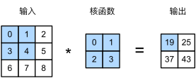
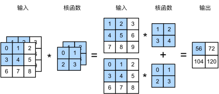
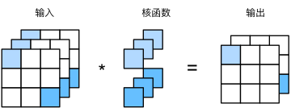
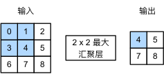

# 卷积神经网络(CNN)

**CNN**：Convolutional Neural Network。

## 卷积层(convolutional)


$$ 0 \times 0 + 1 \times 1 + 3 \times 2 + 4 \times 3 = 19 $$

严格讲，卷积层是错误叫法，因为其实是**互相关运算**（`cross-correlation`），而非卷积运算。

```python
class Conv2D(nn.Module):
  def __init__(self, kernel_size):
    super().__init__()
    self.weight = nn.Parameter(torch.rand(kernel_size))
    self.bias = nn.Parameter(torch.zeros(1))

  def forward(self, x):
    return corr2d(x, self.weight) + self.bias
```

**二维卷积层**的核心计算是二维互相关运算。最简单的形式是，对二维输入数据和卷积核执行互相关操作，然后添加一个偏置。

### 卷积核

$$
[H]_{i,j,d} = \sum_{a=-\Delta}^{\Delta}\sum_{b=-\Delta}^{\Delta}\sum_{c}[V]_{a,b,c,d}[X]_{i+a,j+b,c}
$$

在深度学习研究社区中，V 被称为卷积核（`convolution kernel`）或者滤波器（`filter`），亦或简单地称之为该**卷积层的权重**，通常该权重是**可学习**的参数。

一个卷积层可有多个**卷积核，与输出通道数相等**，每个卷积核**生成一个对应特征图**。

- **每个卷积核产生一个特征图**：每个卷积核通过在输入图像（或输入特征图）上滑动，执行卷积运算，生成一个特征图。卷积核的数量通常决定了该卷积层输出的特征图(`feature maps`)的数量。
- **多个卷积核**：一个卷积层可以有多个卷积核。例如，如果某个卷积层有 32 个卷积核，那么它就会输出 32 个特征图。这些特征图捕捉了输入图像的不同特征（如边缘、纹理、模式等）。

- **与输出通道数相关**：在卷积神经网络（CNN）中，卷积核数量**决定输出通道数**。

**输入通道数**（`in_channels`）仅影响卷积核深度、不影响卷积核数量。

在 `PyTorch`（或其他深度学习框架）中，卷积模块（如 `nn.Conv2d`）的参数设计看起来似乎没有直接指定“卷积核数量”，但实际上**输出通道数（`out_channels`）就是卷积核数量**。这是因为它通过隐式约定简化了参数传递。

### 多输入多输出通道

多输入多输出通道可以用来扩展卷积层的模型。

$$ (1 \times 1 + 2 \times 2 + 4 \times 3 + 5 \times 4) + (0 \times 0 + 1 \times 1 + 3 \times 2 + 4 \times 3) = 56 $$
代码实现：

```py
import torch
from d2l import torch as d2l

def corr2d_multi_in(X, K):
  # 先遍历“X”和“K”的第0个维度（通道维度），再把它们加在一起
  return sum(d2l.corr2d(x, k) for x, k in zip(X, K))

# 多输出通道计算
def corr2d_multi_in_out(X, K):
  # 迭代“K”的第0个维度，每次都对输入“X”执行互相关运算。
  # 最后将所有结果都叠加在一起
  return torch.stack([corr2d_multi_in(X, k) for k in K], 0)
```

### 1X1 卷积层

$1 \times 1$ 卷积，相当于全连接层，即 $k_h = k_w = 1$ 似乎没有多大意义，毕竟卷积的本质是有效提取相邻像素间的相关特征。它唯一的计算，是在通道数量上，通常用于调整通道数量和控制模型复杂性。

如图 3 个输入通道，**通过 2 个卷积核**，调整成 2 个输出通道。

### 感受野

输出的卷积层有时被称为**特征映射**（`feature map`），因为它可以被视为一个输入映射到下一层的空间维度的转换器。

在卷积神经网络中，对于某一层的任意元素，其感受野（`receptive field`）是指在前向传播期间可能影响计算的所有元素（`来自所有先前层`）。

### 可视化

众所周知，深度学习仍是一个黑盒子，模型内部的逻辑含义仍旧无法解释，越是未知的东西，越能激起人们的好奇心。在卷积神经网络中，有时会对卷积核以及特征图进行可视化，以此观察卷积神经网络学习到了何种模式。

用 `TensorBoard` 实现可视化。

- python 代码中将可视化的数据记录到 `event file` 中，保存至硬盘。
- 采用 `tensorboard` 对 `event file` 文件进行读取，并在 `web` 端进行可视化。

```bash
# 先运行目标python文件，生成 event file
python xxx.py
# 在目标文件夹内启动命令
tensorboard --logdir=your_path_dir
# 打开浏览器 http://localhost:6006/
```

## 汇聚层(pooling)

处理图像时，希望降低隐藏表示的空间分辨率、聚集信息，提升每个神经元感受野。汇聚（`pooling`）层双重目的：**降低**卷积层对**位置敏感性**，**降低**对空间**降采样**表示敏感性。

不同于卷积层**互相关计算**，汇聚层不包含参数。相反，**池运算**是确定性的。

通常计算汇聚窗口中所有元素的最大值或平均值，分别称为**最大汇聚层**（`maximum pooling`）和**平均汇聚层**（`average pooling`）。


$$
\max(0,1,3,4) = 4
$$

使用最大汇聚层以及大于 1 的步幅，可减少空间维度（如高度和宽度）。

### 多通道计算

汇聚层在**每个输入通道上单独运算**，而不是像卷积层对输入进行汇总。即：汇聚层的**输出通道数与输入通道数相同**。通过这种设计，汇聚层能高效压缩特征图尺寸，增强模型的平移不变性和计算效率。

### 小结

- **卷积层**：**三维操作**（空间+通道），通过学习改变特征深度和空间尺寸，核心是**特征提取**。  
  在 CNN 中，从低级特征（如边缘）逐步组合到高级特征（如物体部件、整体结构）的过程中，**通道数通常会增加**。例外的是，降维操作或末端层可能减少通道，但通常发生在局部或最终阶段。
- **汇聚层**：**二维操作**（仅空间），固定规则压缩宽高，核心是**尺寸压缩和信息浓缩**。
