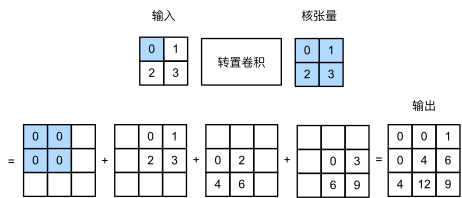
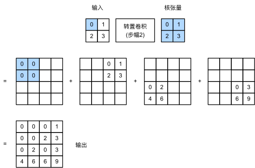
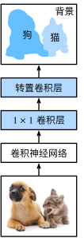

# CV：Computer Vision

## 微调(fine-tuning)

**迁移学习**将从源数据集中学到的知识迁移到目标数据集，**微调**是迁移学习的常见技巧。

**微调**包括以下四个步骤：

1. 在源数据集（例如 ImageNet 数据集）上预训练神经网络模型，即**源模型**。
2. 创建一个新的神经网络模型，即**目标模型**。这将复制源模型上的所有模型设计及其参数（输出层除外）。我们假定这些模型参数包含从源数据集中学到的知识，这些知识也将适用于目标数据集。我们还假设源模型的输出层与源数据集的标签密切相关；因此不在目标模型中使用该层。
3. 向目标模型添加**输出层**，其输出数是目标数据集中的类别数。然后随机初始化该层的模型参数。
4. 在目标数据集（如椅子数据集）上训练目标模型。**输出层将从头开始**进行训练，而**其他层**参数将根据源模型参数进行**微调**。

通常，**微调**参数使用**较小学习率**，而**从头开始**训练输出层可以使用**更大学习率**。

## 目标检测和边界框

很多时候图像里有多个我们感兴趣的目标，我们不仅想知道它们的类别，还想得到它们在图像中的**具体位置**，这类任务称为**目标检测**<sup>object detection</sup>或**目标识别**<sup>object recognition</sup>。

## 交并比(IoU)

**IoU**: Intersection Over Union，**交集除以并集**，也被称为杰卡德系数。

$$
J(A, B) = \frac{|A \cap B|}{|A \cup B|}
$$

交并比的取值范围在 0 和 1 之间：0 表示两个边界框无重合像素，1 表示两个边界框完全重合。

## 语义分割

语义分割<sup>semantic segmentation</sup>重点关注于如何将图像分割成属于不同语义类别的区域。与目标检测不同，语义分割标注的**像素级**边框显然更加**精细**。

## 转置卷积(上采样)

卷积神经网络<sup>CNN</sup>的卷积层和汇聚层，通常会减少**下采样**输入图像空间维度（高和宽）。


**转置卷积**<sup>transposed convolution</sup>通过卷积核**广播**输入元素，增加**上采样**中间层特征图空间维度，实现**输出大于输入**，用于逆转下采样导致的空间尺寸减小。

**填充**：转置卷积中，填充被应**用于输出**（常规卷积将填充应用于输入）。例如，当将高和宽两侧填充数指定为 1 时，转置卷积输出中将**删除第一和最后的行与列**。


**步幅**：被指定为中间结果（输出），而不是输入。

**多输入和输出通道**：转置卷积与常规卷积以**相同**方式运作。

**矩阵变换**：转置卷积层能够**交换**卷积层的**正向传播**函数和**反向传播**函数。

## 全卷积网络(FCN)

**FCN**：Fully Convolutional Network。

通过**转置卷积**，将中间层特征图的高和宽变换回输入图像的尺寸，输出类别预测与输入图像在像素级别上具有一一对应关系：**通道维输出**即该位置对应像素的**类别预测**。

### 构造模型


全卷积网络先使用**卷积神经网络**抽取图像特征，然后通过 $1 \times 1$ 卷积层**将通道数变换为类别个数**，最后通过**转置卷积层**将特征图高和宽**变换为输入图像尺寸**。因此，模型输出与输入图像的高和宽相同，且最终输出通道包含了该空间位置像素的类别预测。

### 初始化转置卷积层

在图像处理中，我们有时需要**将图像放大**，即**上采样**<sup>upsampling</sup>。

**双线性插值**<sup>bilinear interpolation</sup> 是常用上采样方法之一，它也经常用于**初始化**转置卷积层。

1. 将输出图像的坐标 $(x, y)$ 映射到输入图像的坐标 $(x', y')$ 上。例如，根据输入与输出的尺寸之比来映射。请注意，映射后的 $x'$ 和 $y'$ 是实数。
2. 在输入图像上找到离坐标 $(x', y')$ 最近的 4 个像素。
3. 输出图像在坐标 $(x, y)$ 的像素依据输入图像这 4 个像素及其与 $(x', y')$ 相对距离来计算。

```py
def bilinear_kernel(in_channels, out_channels, kernel_size):
  factor = (kernel_size + 1) // 2
  if kernel_size % 2 == 1:
      center = factor - 1
  else:
      center = factor - 0.5
  og = (torch.arange(kernel_size).reshape(-1, 1),
        torch.arange(kernel_size).reshape(1, -1))
  filt = (1 - torch.abs(og[0] - center) / factor) * \
          (1 - torch.abs(og[1] - center) / factor)
  weight = torch.zeros((in_channels, out_channels,
                        kernel_size, kernel_size))
  weight[range(in_channels), range(out_channels), :, :] = filt
  return weight
```
