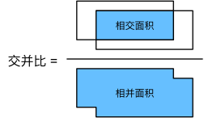
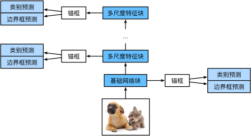

# CV：Computer Vision

计算机视觉、机器视觉。无论是医疗诊断、**自动驾驶**，还是智能滤波器、摄像头监控，许多计算机视觉领域的应用都与我们当前和未来的生活密切相关。

## 微调(fine-tuning)

**迁移学习**将从源数据集中学到的知识迁移到目标数据集，**微调**是迁移学习的常见技巧。

**微调**包括以下四个步骤：

1. 在源数据集（例如 ImageNet 数据集）上预训练神经网络模型，即**源模型**。
2. 创建一个新的神经网络模型，即**目标模型**。这将复制源模型上的所有模型设计及其参数（输出层除外）。我们假定这些模型参数包含从源数据集中学到的知识，这些知识也将适用于目标数据集。我们还假设源模型的输出层与源数据集的标签密切相关；因此不在目标模型中使用该层。
3. 向目标模型添加**输出层**，其输出数是目标数据集中的类别数。然后随机初始化该层的模型参数。
4. 在目标数据集（如椅子数据集）上训练目标模型。**输出层将从头开始**进行训练，而**其他层**参数将根据源模型参数进行**微调**。

通常，**微调**参数使用**较小学习率**，而**从头开始**训练输出层可以使用**更大学习率**。

**示意代码**：

```py
import os
import torch
import torchvision
from torch import nn
from d2l import torch as d2l

finetune_net = torchvision.models.resnet18(pretrained=True)
finetune_net.fc = nn.Linear(finetune_net.fc.in_features, 2)
nn.init.xavier_uniform_(finetune_net.fc.weight)

# 如果param_group=True，输出层中的模型参数将使用十倍的学习率
def train_fine_tuning(net, learning_rate, batch_size=128, num_epochs=5, param_group=True):
  train_iter = torch.utils.data.DataLoader(torchvision.datasets.ImageFolder(
    os.path.join(data_dir, 'train'), transform=train_augs),
    batch_size=batch_size, shuffle=True)

  test_iter = torch.utils.data.DataLoader(torchvision.datasets.ImageFolder(
    os.path.join(data_dir, 'test'), transform=test_augs),
    batch_size=batch_size)

  devices = d2l.try_all_gpus()
  loss = nn.CrossEntropyLoss(reduction="none")

  if param_group:
    params_1x = [
      param for name, param in net.named_parameters() if name not in ["fc.weight", "fc.bias"]
    ]
    trainer = torch.optim.SGD(
      [{'params': params_1x}, {'params': net.fc.parameters(), 'lr': learning_rate * 10}],
      lr=learning_rate, weight_decay=0.001
    )
  else:
    trainer = torch.optim.SGD(net.parameters(), lr=learning_rate, weight_decay=0.001)

  d2l.train_ch13(net, train_iter, test_iter, loss, trainer, num_epochs, devices)

# 使用较小学习率，通过微调预训练获得的模型参数
train_fine_tuning(finetune_net, 5e-5)
```

## 目标检测与边界框 🔥🔥🔥

**目标检测/识别**：不仅可以检测<sup>object detection</sup>识别<sup>object recognition</sup>图像中所有感兴趣的物体，还能识别它们的位置，该位置通常由矩形边界框表示。

**边界框**：在目标检测中，通常使用边界框<sup>bounding box</sup>来描述对象的空间位置。

边界框通常是**矩形**，两种常用边界框表示「中心 $(x,y)$，宽度，高度」和「左上 $x$，右下 $y$」。

## 锚框与交并比(IoU)

### 锚框

目标检测算法通常会采样大量区域，判断其中是否包含目标，并调整边界更准确地预测目标真实边界框<sup>ground-truth bounding box</sup>，这些边界框被称为锚框<sup>anchor box</sup>。

不同模型采样各异。比如以每个像素为中心，生成多个缩放比和宽高比<sup>aspect ratio</sup>的不同边界框。

```py
# 生成以每个像素为中心具有不同形状的锚框
def multibox_prior(data, sizes, ratios):
  in_height, in_width = data.shape[-2:]
  device, num_sizes, num_ratios = data.device, len(sizes), len(ratios)
  boxes_per_pixel = (num_sizes + num_ratios - 1)
  size_tensor = torch.tensor(sizes, device=device)
  ratio_tensor = torch.tensor(ratios, device=device)

  # 为了将锚点移动到像素的中心，需要设置偏移量。
  # 因为一个像素的高为1且宽为1，我们选择偏移我们的中心0.5
  offset_h, offset_w = 0.5, 0.5
  steps_h = 1.0 / in_height  # 在y轴上缩放步长
  steps_w = 1.0 / in_width  # 在x轴上缩放步长

  # 生成锚框的所有中心点
  center_h = (torch.arange(in_height, device=device) + offset_h) * steps_h
  center_w = (torch.arange(in_width, device=device) + offset_w) * steps_w
  shift_y, shift_x = torch.meshgrid(center_h, center_w, indexing='ij')
  shift_y, shift_x = shift_y.reshape(-1), shift_x.reshape(-1)

  # 生成“boxes_per_pixel”个高和宽，
  # 之后用于创建锚框的四角坐标(xmin,xmax,ymin,ymax)
  w = torch.cat((size_tensor * torch.sqrt(ratio_tensor[0]),
                  sizes[0] * torch.sqrt(ratio_tensor[1:])))\
                  * in_height / in_width  # 处理矩形输入
  h = torch.cat((size_tensor / torch.sqrt(ratio_tensor[0]),
                  sizes[0] / torch.sqrt(ratio_tensor[1:])))
  # 除以2来获得半高和半宽
  anchor_manipulations = torch.stack((-w, -h, w, h)).T.repeat(in_height * in_width, 1) / 2

  # 每个中心点都将有“boxes_per_pixel”个锚框，
  # 所以生成含所有锚框中心的网格，重复了“boxes_per_pixel”次
  out_grid = torch.stack([shift_x, shift_y, shift_x, shift_y],
              dim=1).repeat_interleave(boxes_per_pixel, dim=0)
  output = out_grid + anchor_manipulations
  return output.unsqueeze(0)
```

那么如何衡量锚框**准确性**呢？换言之，若已知目标真实边界框，如何衡量锚框和**真实边界框**之间**相似性**？杰卡德系数<sup>Jaccard</sup>可以衡量两者之间相似性。

### 交并比

**IoU**：Intersection Over Union **交并比**，两个边界框**交集除以并集**，也被称为杰卡德系数。

$$
J(A, B) = \frac{|A \cap B|}{|A \cup B|}
$$

交并比的取值范围在 0 和 1 之间：0 表示两个边界框无重合像素，1 表示两个边界框完全重合。


```py
# 计算两个锚框或边界框列表中成对的交并比
def box_iou(boxes1, boxes2):
  box_area = lambda boxes: ((boxes[:, 2] - boxes[:, 0]) * (boxes[:, 3] - boxes[:, 1]))
  # boxes1,boxes2,areas1,areas2的形状:
  # boxes1：(boxes1的数量,4),
  # boxes2：(boxes2的数量,4),
  # areas1：(boxes1的数量,),
  # areas2：(boxes2的数量,)
  areas1 = box_area(boxes1)
  areas2 = box_area(boxes2)
  # inter_upperlefts,inter_lowerrights,inters的形状:
  # (boxes1的数量,boxes2的数量,2)
  inter_upperlefts = torch.max(boxes1[:, None, :2], boxes2[:, :2])
  inter_lowerrights = torch.min(boxes1[:, None, 2:], boxes2[:, 2:])
  inters = (inter_lowerrights - inter_upperlefts).clamp(min=0)
  # inter_areasandunion_areas的形状:(boxes1的数量,boxes2的数量)
  inter_areas = inters[:, :, 0] * inters[:, :, 1]
  union_areas = areas1[:, None] + areas2 - inter_areas
  return inter_areas / union_areas
```

### 小结

**训练时**：我们需要给每个锚框两种类型的标签。一个是与锚框中目标检测的类别，另一个是锚框真实相对于边界框的偏移量。

**预测时**：可以使用**非极大值抑制**<sup>non-maximum suppression，NMS</sup>来**移除类似**预测边界框，从而简化输出。

## 单发多框检测(SSD)

**SSD**：Single Shot MultiBox Detector，是一种高效的目标检测算法，由`Wei Liu`等人在 2016 年[论文](https://arxiv.org/abs/1512.02325)中提出。它通过**单次前向传播**即可完成目标检测，具有**速度快、精度高**的特点，广泛应用于**实时检测**场景。

“单发”（`Single Shot`）是指算法仅需一次前向传播（即“单次通过神经网络”）即可直接输出检测结果，无需像传统两阶段方法（如 Faster R-CNN）那样先生成候选区域（Region Proposals），再对候选区域进行分类和回归。

在多个尺度下，生成**不同尺寸锚框来检测不同尺寸目标**。通过定义特征图的形状，决定任何图像上均匀采样的锚框中心。使用输入图像在某个**感受野**区域内信息，来预测输入图像上与该区域位置相近的锚框类别和偏移量。通过**深度学习**，用**多层次图像分层**表示进行**多尺度目标检测**。

### 模型

单发多框检测模型主要由**一个基础网络**块和若干**多尺度特征**块**串联**而成。


### 类别预测层

设目标类别数量为 $q$。这样一来，锚框有 $q+1$ 个类别，其中 0 类是背景。

```py
import torch
import torchvision
from torch import nn
from torch.nn import functional as F
from d2l import torch as d2l

def cls_predictor(num_inputs, num_anchors, num_classes):
  return nn.Conv2d(num_inputs, num_anchors * (num_classes + 1), kernel_size=3, padding=1)
```

使用填充为 1 的 3x3 的卷积层，此卷积层的**输入和输出**宽度和高度**保持不变**。这样一来，输出和输入在特征图宽和高上的空间坐标一一对应。

### 边界框预测层

```py
def bbox_predictor(num_inputs, num_anchors):
  return nn.Conv2d(num_inputs, num_anchors * 4, kernel_size=3, padding=1)
```

不同的是，这里需要为每个锚框预测 4 个偏移量，而不是 num_classes + 1 个类别。

### 连结多尺度的预测

```py
def forward(x, block):
  return block(x)

Y1 = forward(torch.zeros((2, 8, 20, 20)), cls_predictor(8, 5, 10))
Y2 = forward(torch.zeros((2, 16, 10, 10)), cls_predictor(16, 3, 10))
Y1.shape, Y2.shape
# (torch.Size([2, 55, 20, 20]), torch.Size([2, 33, 10, 10]))
```

除批量大小外，其他三个维度都不同尺寸。将预测结果转成二维(`批量大小，高 x 宽 x 通道数`)格式，后在维度 1 上连结。

```py
def flatten_pred(pred):
  return torch.flatten(pred.permute(0, 2, 3, 1), start_dim=1)

def concat_preds(preds):
  return torch.cat([flatten_pred(p) for p in preds], dim=1)

concat_preds([Y1, Y2]).shape
# torch.Size([2, 25300])
```

### 高和宽减半块

```py
def down_sample_blk(in_channels, out_channels):
  blk = []
  for _ in range(2):
    blk.append(nn.Conv2d(in_channels, out_channels, kernel_size=3, padding=1))
    blk.append(nn.BatchNorm2d(out_channels))
    blk.append(nn.ReLU())
    in_channels = out_channels
  blk.append(nn.MaxPool2d(2))
  return nn.Sequential(*blk)
```

由两个填充为 1 的 3x3 卷积层(不变)、以及步幅为 2 的 2x2 最大汇聚层(减半)组成。

对于此高和宽减半块的输入和输出特征图，1x2+(3-1)+(3-1)=6，所以输出中每个单元在输入上都有一个 6x6 感受野。因此，**高和宽减半**块会**扩大**每个单元在其输出特征图中的**感受野**。

```py
forward(torch.zeros((2, 3, 20, 20)), down_sample_blk(3, 10)).shape
# torch.Size([2, 10, 10, 10])
```

## 语义分割 🔥🔥🔥

目标检测中，我们一直使用**方形边界框**来标注和预测图像中的目标。

### 核心概念

**语义分割**<sup>semantic segmentation</sup>，本质是密集预测<sup>Dense Prediction</sup>，为**每个像素**分配一个语义类别标签（如“人”“车”“天空”），实现像素级别分类。标注和预测都是**像素级**，比目标检测**更精细**。

语义分割输入图像和标签在像素上一一对应，输入图像会被**随机裁剪**为固定尺寸而**不是缩放**。

### 关键技术

- **全卷积网络(FCN)**：将传统 CNN 中的全连接层替换为卷积层，使网络可以接受任意尺寸的输入并输出相应尺寸的分割图。
- **编码器-解码器结构**：编码器通过卷积和下采样提取高级特征，解码器通过上采样恢复空间分辨率。
- **跳跃连接(Skip Connection)**：将浅层特征与深层特征融合，保留更多空间细节信息。

传统 CNN 全连接展平、全局池化会丢失`位置信息、相邻像素的梯度、区域一致性`等**空间信息**，而语义分割需要保留空间分辨率，因此必须使用**全卷积结构**。

### 经典模型

**1. FCN (Fully Convolutional Networks)**

- 首个端到端的全卷积语义分割网络
- 使用**转置卷积**进行上采样
- 引入跳跃连接融合多层特征

**2. U-Net**([论文地址](https://arxiv.org/abs/1505.04597))

- 医学图像分割的经典网络
- **结构对称**的编码器-解码器
- 大量跳跃连接保留细节信息

**3. DeepLab 系列**

- 使用空洞卷积(Atrous Convolution)扩大感受野
- 引入 ASPP(Atrous Spatial Pyramid Pooling)模块捕捉多尺度信息
- 使用 CRF(Conditional Random Field)后处理细化边界

## 全卷积网络(FCN)

**FCN**：Fully Convolutional Network，即网络**完全由卷积层构成**，没有任何全连接层。

这一设计使得网络能够处理任意尺寸的输入图像，并输出相应尺寸的密集预测（如图像分割中的逐像素分类）。

通过**转置卷积**，将中间层特征图的高和宽变换回输入图像的尺寸，输出类别预测与输入图像在像素级别上具有一一对应关系：**通道维输出**即该位置对应像素的**类别预测**。

### 初始化转置卷积层

在图像处理中，我们有时需要**将图像放大**，即**上采样**<sup>upsampling</sup>。

**双线性插值**<sup>bilinear interpolation</sup> 是常用上采样方法之一，它也经常用于**初始化**转置卷积层。

1. 将输出图像的坐标 $(x, y)$ 映射到输入图像的坐标 $(x', y')$ 上。例如，根据输入与输出的尺寸之比来映射。请注意，映射后的 $x'$ 和 $y'$ 是实数。
2. 在输入图像上找到离坐标 $(x', y')$ 最近的 4 个像素。
3. 输出图像在坐标 $(x, y)$ 的像素依据输入图像这 4 个像素及其与 $(x', y')$ 相对距离来计算。

```py
def bilinear_kernel(in_channels, out_channels, kernel_size):
  factor = (kernel_size + 1) // 2
  if kernel_size % 2 == 1:
    center = factor - 1
  else:
    center = factor - 0.5
  og = (torch.arange(kernel_size).reshape(-1, 1),
        torch.arange(kernel_size).reshape(1, -1))
  filt = (1 - torch.abs(og[0] - center) / factor) * \
          (1 - torch.abs(og[1] - center) / factor)
  weight = torch.zeros((in_channels, out_channels, kernel_size, kernel_size))
  weight[range(in_channels), range(out_channels), :, :] = filt
  return weight
```

### 构造模型


1. 先使用**卷积神经网络**抽取图像特征——**编码器**提取特征(下采样)。
2. 然后 1x1 卷积层**将通道数变换为类别个数**——调整通道数。
3. 最后**转置卷积层**将特征图高和宽**变换为输入图像尺寸**——**解码器**恢复分辨率(上采样)。

因此，模型输出与输入图像的高和宽相同，且最终输出通道包含了该空间位置像素类别预测。

```py
import torch
import torchvision
from torch import nn
from torch.nn import functional as F
from d2l import torch as d2l

# 1.使用ImageNet数据集上预训练的ResNet-18来提取图像特征(编码器)
pretrained_net = torchvision.models.resnet18(pretrained=True)
net = nn.Sequential(*list(pretrained_net.children())[:-2])

# 使用Pascal VOC2012训练集
num_classes = 21
# 2.添加1x1卷积层(调整通道数)
net.add_module('final_conv', nn.Conv2d(512, num_classes, kernel_size=1))
# 3.添加转置卷积层(解码器)
# 步幅为s，填充为s/2(整数)且卷积核高和宽为2s，转置卷积核会将输入高和宽分别放大s倍
net.add_module('transpose_conv', nn.ConvTranspose2d(num_classes,
                num_classes, kernel_size=64, padding=16, stride=32))

# 用双线性插值的上采样初始化转置卷积层
W = bilinear_kernel(num_classes, num_classes, 64)
net.transpose_conv.weight.data.copy_(W)

# 损失函数
# 因为使用通道预测像素类别，所以需要指定通道维。用每个像素预测类别是否正确来计算准确率。
def loss(inputs, targets):
  return F.cross_entropy(inputs, targets, reduction='none').mean(1).mean(1)

# 训练
num_epochs, lr, wd, devices = 5, 0.001, 1e-3, d2l.try_all_gpus()
trainer = torch.optim.SGD(net.parameters(), lr=lr, weight_decay=wd)
d2l.train_ch13(net, train_iter, test_iter, loss, trainer, num_epochs, devices)

# 预测
# 需要将输入图像在各个通道做标准化，并转成卷积神经网络所需要四维输入格式
def predict(img):
  X = test_iter.dataset.normalize_image(img).unsqueeze(0)
  pred = net(X.to(devices[0])).argmax(dim=1)
  return pred.reshape(pred.shape[1], pred.shape[2])

# 为可视化预测类别给每个像素，将预测类别映射回它们在数据集中的标注颜色
def label2image(pred):
  colormap = torch.tensor(d2l.VOC_COLORMAP, device=devices[0])
  X = pred.long()
  return colormap[X, :]

# 预测启动
voc_dir = d2l.download_extract('voc2012', 'VOCdevkit/VOC2012')
test_images, test_labels = d2l.read_voc_images(voc_dir, False)
n, imgs = 4, []
for i in range(n):
    crop_rect = (0, 0, 320, 480)
    X = torchvision.transforms.functional.crop(test_images[i], *crop_rect)
    pred = label2image(predict(X))
    imgs += [X.permute(1,2,0), pred.cpu(),
             torchvision.transforms.functional.crop(
                 test_labels[i], *crop_rect).permute(1,2,0)]
d2l.show_images(imgs[::3] + imgs[1::3] + imgs[2::3], 3, n, scale=2)
```

## 转置卷积(反卷积/上采样)

卷积神经网络<sup>CNN</sup>的卷积层和汇聚层，通常会减少**下采样**输入图像空间维度（高和宽）。


**转置卷积**<sup>transposed convolution</sup>通过卷积核**广播**输入元素，增加**上采样**中间层特征图空间维度，实现**输出大于输入**，用于逆转下采样导致的空间尺寸减小。

**填充**：转置卷积中，填充被应**用于输出**（常规卷积将填充应用于输入）。例如，当将高和宽两侧填充数指定为 1 时，转置卷积输出中将**删除第一和最后的行与列**。


**步幅**：被指定为中间结果（输出），而不是输入。

**多输入和输出通道**：转置卷积与常规卷积以**相同**方式运作。

**矩阵变换**：转置卷积层能够**交换**卷积层的**正向传播**函数和**反向传播**函数。

## 风格迁移(style transfer)🔥🔥🔥

把一张图的“内容”和另一张图的“风格”结合，生成一张“内容不变但风格变化”的图。

**典型例子：**
你拍了一张猫，用梵高《星夜》风格迁移它，就能得到一张“星夜风格猫”。

**底层原理(简化)：**

- 内容图像保留结构和形状信息（比如人脸、物体轮廓）。
- 风格图像提供纹理、颜色、笔触风格等。
- 通过神经网络（如卷积神经网络 CNN）提取两者的特征，并组合输出。

**常见技术：**

- Gatys 等人提出的经典神经风格迁移（基于 VGG 网络）。
- 更快的实时风格迁移（Fast Style Transfer）用于移动端 App（如 Prisma）。

**编码实现：**

```py
import torch
import torchvision
from torch import nn
from d2l import torch as d2l

content_img = d2l.Image.open('../img/rainier.jpg')
style_img = d2l.Image.open('../img/autumn-oak.jpg')

# 预处理和后处理
rgb_mean = torch.tensor([0.485, 0.456, 0.406])
rgb_std = torch.tensor([0.229, 0.224, 0.225])

def preprocess(img, image_shape):
  transforms = torchvision.transforms.Compose([
    torchvision.transforms.Resize(image_shape),
    torchvision.transforms.ToTensor(),
    torchvision.transforms.Normalize(mean=rgb_mean, std=rgb_std)])
  return transforms(img).unsqueeze(0)

def postprocess(img):
  img = img[0].to(rgb_std.device)
  img = torch.clamp(img.permute(1, 2, 0) * rgb_std + rgb_mean, 0, 1)
  return torchvision.transforms.ToPILImage()(img.permute(2, 0, 1))

# 抽取图像特征
# 使用基于ImageNet数据集预训练的VGG-19模型来抽取图像特征
pretrained_net = torchvision.models.vgg19(pretrained=True)
style_layers, content_layers = [0, 5, 10, 19, 28], [25]
# 抽取特定层，新建网络模型
net = nn.Sequential(*[pretrained_net.features[i] for i in range(max(content_layers + style_layers) + 1)])
# 抽取、存储目标内容层和风格层
def extract_features(X, content_layers, style_layers):
  contents = []
  styles = []
  for i in range(len(net)):
    X = net[i](X)
    if i in style_layers:
      styles.append(X)
    if i in content_layers:
      contents.append(X)
  return contents, styles

# 抽取内容特征
def get_contents(image_shape, device):
  content_X = preprocess(content_img, image_shape).to(device)
  contents_Y, _ = extract_features(content_X, content_layers, style_layers)
  return content_X, contents_Y
# 抽取风格特征
def get_styles(image_shape, device):
  style_X = preprocess(style_img, image_shape).to(device)
  _, styles_Y = extract_features(style_X, content_layers, style_layers)
  return style_X, styles_Y


# 定义损失函数(内容损失 + 风格损失 + 全变分损失)
# 内容损失：使合成图像与内容图像在内容特征上接近
# 通过平方误差函数衡量合成图像与内容图像在 内容特征 差异
def content_loss(Y_hat, Y):
  # 我们从动态计算梯度的树中分离目标：
  # 这是一个规定的值，而不是一个变量。
  return torch.square(Y_hat - Y.detach()).mean()

# 风格损失：使合成图像与风格图像在风格特征上接近
# 通过平方误差函数衡量合成图像与风格图像在 风格特征 差异
def style_loss(Y_hat, gram_Y):
  return torch.square(gram(Y_hat) - gram_Y.detach()).mean()
# 格拉姆矩阵：表达风格特征之间互相关性，表达风格层输出的风格
def gram(X):
  num_channels, n = X.shape[1], X.numel() // X.shape[1]
  X = X.reshape((num_channels, n))
  return torch.matmul(X, X.T) / (num_channels * n)

# 全变分损失：减少合成图像中噪点
# 合成图像会有高频噪点，极暗或极亮。全变分去噪(total variation denoising)使邻近像素值相似。
def tv_loss(Y_hat):
  return 0.5 * (torch.abs(Y_hat[:, :, 1:, :] - Y_hat[:, :, :-1, :]).mean() +
               torch.abs(Y_hat[:, :, :, 1:] - Y_hat[:, :, :, :-1]).mean())

# 风格转移损失函数是内容损失、风格损失和总变化损失的加权和
content_weight, style_weight, tv_weight = 1, 1e3, 10
def compute_loss(X, contents_Y_hat, styles_Y_hat, contents_Y, styles_Y_gram):
  # 分别计算内容损失、风格损失和全变分损失
  contents_l = [content_loss(Y_hat, Y) * content_weight for Y_hat, Y in zip(contents_Y_hat, contents_Y)]
  styles_l = [style_loss(Y_hat, Y) * style_weight for Y_hat, Y in zip(styles_Y_hat, styles_Y_gram)]
  tv_l = tv_loss(X) * tv_weight
  # 对所有损失求和
  l = sum(10 * styles_l + contents_l + [tv_l])
  return contents_l, styles_l, tv_l, l

# 初始化合成图像：风格迁移中，合成的图像是训练期间唯一需要更新的变量。
# 定义一个模型，将合成图像视为模型参数，模型前向传播只需返回模型参数即可。
class SynthesizedImage(nn.Module):
  def __init__(self, img_shape, **kwargs):
    super(SynthesizedImage, self).__init__(**kwargs)
    self.weight = nn.Parameter(torch.rand(*img_shape))

  def forward(self):
    return self.weight

# 创建模型实例，并初始化为内容图像 X
def get_inits(X, device, lr, styles_Y):
  gen_img = SynthesizedImage(X.shape).to(device)
  gen_img.weight.data.copy_(X.data)
  trainer = torch.optim.Adam(gen_img.parameters(), lr=lr)
  styles_Y_gram = [gram(Y) for Y in styles_Y]
  return gen_img(), styles_Y_gram, trainer

# 训练
def train(X, contents_Y, styles_Y, device, lr, num_epochs, lr_decay_epoch):
  X, styles_Y_gram, trainer = get_inits(X, device, lr, styles_Y)
  scheduler = torch.optim.lr_scheduler.StepLR(trainer, lr_decay_epoch, 0.8)
  animator = d2l.Animator(xlabel='epoch', ylabel='loss', xlim=[10, num_epochs],
                          legend=['content', 'style', 'TV'],
                          ncols=2, figsize=(7, 2.5))
  for epoch in range(num_epochs):
    trainer.zero_grad()
    contents_Y_hat, styles_Y_hat = extract_features(X, content_layers, style_layers)
    contents_l, styles_l, tv_l, l = compute_loss(X, contents_Y_hat, styles_Y_hat, contents_Y, styles_Y_gram)
    l.backward()
    trainer.step()
    scheduler.step()
    if (epoch + 1) % 10 == 0:
      animator.axes[1].imshow(postprocess(X))
      animator.add(epoch + 1, [float(sum(contents_l)), float(sum(styles_l)), float(tv_l)])
  return X

# gogogo!!!
device, image_shape = d2l.try_gpu(), (300, 450)
net = net.to(device)
content_X, contents_Y = get_contents(image_shape, device)
_, styles_Y = get_styles(image_shape, device)
output = train(content_X, contents_Y, styles_Y, device, 0.3, 500, 50)
```

**上面编码中技术术语**：

- [格拉姆矩阵(Gram Matrix)](/aiart/deep-learning/basic-concept.html#格拉姆矩阵-gram-matrix)
- **全变分损失**公式为：
  $$
  \sum_{i,j} |x_{i,j} - x_{i+1,j}| + |x_{i,j} - x_{i,j+1}|
  $$
