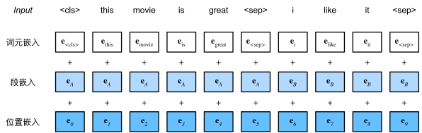

# 自然语言处理(NLP)

**NLP**：Natural Language Processing，是指研究使用自然语言的**计算机和人类**之间的**交互**。

## 预训练(pre-training)

**自监督学习**<sup>self-supervised learning</sup>已被广泛用于**预训练**文本表示，例如通过使用周围文本的其它部分来预测文本的隐藏部分。

### 子词嵌入

```py
# 代码示例（Hugging Face 库）
from transformers import AutoTokenizer

# 加载BERT的WordPiece分词器
tokenizer = AutoTokenizer.from_pretrained("bert-base-uncased")
tokens = tokenizer.tokenize("unhappiness")  # 输出：['un', '##happy', '##ness']

# 加载BPE分词器（GPT-2）
tokenizer = AutoTokenizer.from_pretrained("gpt2")
tokens = tokenizer.tokenize("unhappiness")  # 输出：['un', 'happiness']
```

自然语言是用来表达人脑思维的复杂系统，**词**是意义的基本单元。

- **词向量**：用于表示**单词意义**的向量，并且还可以被认为是单词**特征向量或表示**。
- **词嵌入**：将**单词映射到实向量**的技术。

**子词嵌入**<sup>Subword Embedding</sup>通过**将单词拆分为更小的单元**（子词）来解决传统词嵌入局限性。

- 未登录词（OOV）问题：传统词嵌入（如 Word2Vec）无法处理词汇表外的单词。
- 形态学相似性：子词能捕捉单词间的结构关系（如"running" → "run" + "ing"）。
- 多语言支持：共享子词可跨语言建模（如拉丁语系的共同词根）。

**子词嵌入** = **子词分词**(`BPE`等) + **向量化**<sup>Embedding</sup>

### 字节对编码(BPE)

**BPE**：Byte Pair Encoding，是一种**子词分词算法**<sup>Subword Tokenization</sup>。

**核心思想**：通过迭代**合并高频符号对**(字节对)构建词汇表，有效平衡词表大小与语义覆盖能力。

**基本步骤**：

1. **初始化词汇表**：将所有基本字符（如字母、标点）加入词表。
2. **统计符号对频率**：在训练语料中统计所有相邻符号对的共现频率。
3. **合并最高频对**：将出现频率最高的符号对合并为一个新符号，加入词表。
4. **重复迭代**：持续合并直到达到预设的词表大小或迭代次数。

**示例演示**：

假设语料为 `"low low low lower newest widest"`：

- 初始词表：`{l, o, w, e, r, n, s, t, d, i}`
- 第 1 步：最高频对 `"lo"`（出现 6 次）→ 合并为 `"lo"`，词表新增 `"lo"`。
- 第 2 步：最高频对 `"low"`（出现 4 次）→ 合并为 `"low"`，词表新增 `"low"`。
- 后续可能合并 `"er"`、`"est"`等。
- 最终词表可能包含子词如：`low, er, est, newer, wid`。

**优点优势**：

- **解决未登录词（OOV）**：通过子词组合表示罕见词（如 `"unhappiness"` → `"un" + "happy" + "ness"`）。
- **压缩词表大小**：避免维护超大词表（如英语常用词约 20 万，BPE 词表可压缩到 1 万~3 万）。
- **保留语义**：相似词共享子词（如 `"playing"` 和 `"played"` 共享 `"play"`）。

**代码示例**：

```py
# Hugging Face 库调用
from transformers import GPT2Tokenizer

# GPT-2使用BPE分词
tokenizer = GPT2Tokenizer.from_pretrained("gpt2")
tokens = tokenizer.tokenize("unhappiness")  # 输出：['un', 'happiness']
```

**代码实现**：

```py
import collections

symbols = ['a', 'b', 'c', 'd', 'e', 'f', 'g', 'h', 'i', 'j', 'k', 'l', 'm',
           'n', 'o', 'p', 'q', 'r', 's', 't', 'u', 'v', 'w', 'x', 'y', 'z',
           '_', '[UNK]']

# 频率字典
raw_token_freqs = {'fast_': 4, 'faster_': 3, 'tall_': 5, 'taller_': 4}
token_freqs = {}
for token, freq in raw_token_freqs.items():
  token_freqs[' '.join(list(token))] = raw_token_freqs[token]
token_freqs
# {'f a s t _': 4, 'f a s t e r _': 3, 't a l l _': 5, 't a l l e r _': 4}

# 返回词内最频繁的连续符号对，其中词来自输入词典token_freqs的键
def get_max_freq_pair(token_freqs):
  pairs = collections.defaultdict(int)
  for token, freq in token_freqs.items():
    symbols = token.split()
    for i in range(len(symbols) - 1):
      # “pairs”的键是两个连续符号的元组
      pairs[symbols[i], symbols[i + 1]] += freq
  return max(pairs, key=pairs.get)  # 具有最大值的“pairs”键

# 基于连续符号频率的贪心方法，合并最频繁的连续符号对以产生新符号
def merge_symbols(max_freq_pair, token_freqs, symbols):
  symbols.append(''.join(max_freq_pair))
  new_token_freqs = dict()
  for token, freq in token_freqs.items():
    new_token = token.replace(' '.join(max_freq_pair), ''.join(max_freq_pair))
    new_token_freqs[new_token] = token_freqs[token]
  return new_token_freqs

# 迭代
num_merges = 10
for i in range(num_merges):
  max_freq_pair = get_max_freq_pair(token_freqs)
  token_freqs = merge_symbols(max_freq_pair, token_freqs, symbols)
  print(f'合并# {i+1}:',max_freq_pair)

# 合并# 1: ('t', 'a')
# 合并# 2: ('ta', 'l')
# 合并# 3: ('tal', 'l')
# 合并# 4: ('f', 'a')
# 合并# 5: ('fa', 's')
# 合并# 6: ('fas', 't')
# 合并# 7: ('e', 'r')
# 合并# 8: ('er', '_')
# 合并# 9: ('tall', '_')
# 合并# 10: ('fast', '_')

print(symbols)
# ['a', 'b', 'c', 'd', 'e', 'f', 'g', 'h', 'i', 'j', 'k', 'l', 'm', 'n', 'o', 'p', 'q', 'r', 's', 't', 'u', 'v', 'w', 'x', 'y', 'z', '_', '[UNK]', 'ta', 'tal', 'tall', 'fa', 'fas', 'fast', 'er', 'er_', 'tall_', 'fast_']

print(list(token_freqs.keys()))
# ['fast_', 'fast er_', 'tall_', 'tall er_']

# 用从一个数据集学习的子词来切分另一个数据集的单词
# 尝试将单词从输入参数symbols分成可能最长的子词
def segment_BPE(tokens, symbols):
  outputs = []
  for token in tokens:
    start, end = 0, len(token)
    cur_output = []
    # 具有符号中可能最长子字的词元段
    while start < len(token) and start < end:
      if token[start: end] in symbols:
        cur_output.append(token[start: end])
        start = end
        end = len(token)
      else:
        end -= 1
    if start < len(token):
      cur_output.append('[UNK]')
    outputs.append(' '.join(cur_output))
  return outputs

tokens = ['tallest_', 'fatter_']
print(segment_BPE(tokens, symbols))
# ['tall e s t _', 'fa t t er_']
```

字节对编码执行训练数据集的统计分析，以发现词内的公共符号。作为一种**贪心方法**，字节对编码迭代地**合并最频繁的连续符号对**。

### Transformers 的 BERT

**词嵌入模型**预训练后，输出可认为是一个**矩阵**，每一行都是一个表示预定义词表中词的向量。

但，这些词嵌入模型都是与**上下文无关**的。

**ELMo**：从上下文无关到**上下文敏感**，ELMo<sup>Embeddings from Language Models</sup>为输入序列中的每个单词分配一个表示的函数。具体来说，ELMo 将来自预训练的**双向长短期记忆**网络的所有中间层表示**组合为输出**表示。然后，ELMo 的表示将作为附加特征添加到下游任务的现有监督模型中，例如通过将 ELMo 的表示和现有模型中词元的原始表示连结起来。

尽管，ELMo 显著改进了各种自然语言处理任务的解决方案，但每个解决方案仍然**依赖于一个特定于任务架构**。

**GPT**：生成式预训练<sup>Generative Pre Training</sup>模型为上下文的敏感表示设计了通用**任务无关**模型。GPT 建立在 `Transformer` 解码器的基础上，预训练了一个用于表示文本序列的语言模型。当将 `GPT` 应用于下游任务时，语言模型的输出将被送到一个附加的线性输出层，以预测任务的标签。与 `ELMo` 冻结预训练模型的参数不同，`GPT` 在下游任务的监督学习过程中对预训练 `Transformer` 解码器中的所有参数进行**微调**。

然而，由于语言模型的**自回归**特性，GPT **只能向前看**（从左到右）。

**BERT**：Google 2018 年提出基于 `Transformer` 架构预训练语言模型 BERT<sup>Bidirectional Encoder Representations from Transformers</sup>(双向编码模型)。BERT 推动了**预训练模型**的浪潮，后续模型如 `GPT-3、T5` 等均受其启发。当前趋势转向更大规模（如 `PaLM`）、多模态（如 `CLIP`）和高效训练（如 `LoRA`）。

**1. 核心思想**

- 双向上下文建模：  
  与传统单向语言模型（如 GPT）不同，BERT 通过 **Masked Language Model (MLM)** 同时利用左右两侧的上下文信息，更全面地理解词语含义。
- 预训练+微调：  
  先在大规模语料上无监督预训练，再针对下游任务（如分类、问答）进行少量数据微调。

**2. 关键技术创新**

- Transformer 编码器：  
  完全基于 Transformer 的编码器堆叠（多层 Self-Attention + Feed-Forward），无需解码器。
- 两种预训练任务：
  - MLM（掩码语言模型）：随机遮盖 15% 的单词，预测被遮盖的词。
  - NSP（下一句预测）：判断两个句子是否连续，增强句子间关系理解。
- 输入表示：  
  使用 `[CLS]`（分类标记）、`[SEP]`（分隔标记）和词/段/位置嵌入的三层编码。

**3. 优缺点**

- 优点：
  - 上下文敏感，解决多义词问题（如 "bank" 在金融或河岸的差异）。
  - 通用性强，微调即可适配多种任务。
- 缺点：
  - 计算资源消耗大（尤其是 Large 版本）。
  - 对超长文本处理有限（最大长度通常为 512 token）。

**4. 代码示例(Hugging Face 库)**

```python
from transformers import BertTokenizer, BertModel

# 加载预训练模型和分词器
tokenizer = BertTokenizer.from_pretrained('bert-base-uncased')
model = BertModel.from_pretrained('bert-base-uncased')

# 输入处理
inputs = tokenizer("Hello, BERT!", return_tensors="pt")
outputs = model(**inputs)

# 获取词嵌入或句子表示
last_hidden_states = outputs.last_hidden_state  # 词级别嵌入
pooler_output = outputs.pooler_output          # [CLS] 的句子表示
```

**5. 训练准备及预训练**

与原始 `Transformer` 编码器不同，BERT 使用**可学习位置**嵌入。

**BERT 嵌入 = 词元嵌入 + 片段嵌入 + 位置嵌入**。

```py
import torch
from torch import nn
from d2l import torch as d2l

# 获取输入序列的词元及其片段索引
def get_tokens_and_segments(tokens_a, tokens_b=None):
  tokens = ['<cls>'] + tokens_a + ['<sep>']
  # 0和1分别标记片段A和B
  segments = [0] * (len(tokens_a) + 2)
  if tokens_b is not None:
    tokens += tokens_b + ['<sep>']
    segments += [1] * (len(tokens_b) + 1)
  return tokens, segments

# BERT编码器
class BERTEncoder(nn.Module):
  def __init__(self, vocab_size, num_hiddens, norm_shape, ffn_num_input,
                ffn_num_hiddens, num_heads, num_layers, dropout,
                max_len=1000, key_size=768, query_size=768, value_size=768,
                **kwargs):
    super(BERTEncoder, self).__init__(**kwargs)
    self.token_embedding = nn.Embedding(vocab_size, num_hiddens)
    self.segment_embedding = nn.Embedding(2, num_hiddens)
    self.blks = nn.Sequential()
    for i in range(num_layers):
      self.blks.add_module(f"{i}", d2l.EncoderBlock(
        key_size, query_size, value_size, num_hiddens, norm_shape,
        ffn_num_input, ffn_num_hiddens, num_heads, dropout, True))
    # 在BERT中，位置嵌入是可学习的，因此我们创建一个足够长的位置嵌入参数
    self.pos_embedding = nn.Parameter(torch.randn(1, max_len, num_hiddens))

  def forward(self, tokens, segments, valid_lens):
    # 在以下代码段中，X的形状保持不变：（批量大小，最大序列长度，num_hiddens）
    X = self.token_embedding(tokens) + self.segment_embedding(segments)
    X = X + self.pos_embedding.data[:, :X.shape[1], :]
    for blk in self.blks:
      X = blk(X, valid_lens)
    return X

# 实例化
vocab_size, num_hiddens, ffn_num_hiddens, num_heads = 10000, 768, 1024, 4
norm_shape, ffn_num_input, num_layers, dropout = [768], 768, 2, 0.2
encoder = BERTEncoder(vocab_size, num_hiddens, norm_shape, ffn_num_input,
                      ffn_num_hiddens, num_heads, num_layers, dropout)

# 走起
tokens = torch.randint(0, vocab_size, (2, 8))
segments = torch.tensor([[0, 0, 0, 0, 1, 1, 1, 1], [0, 0, 0, 1, 1, 1, 1, 1]])
encoded_X = encoder(tokens, segments, None)
encoded_X.shape
# torch.Size([2, 8, 768])
```

**预训练**包括 2 个任务：**掩蔽语言模型**<sup>Masked Language Modeling</sup>和**下一句预测**<sup>Next Sentence Prediction</sup>。

前者能够编码双向上下文来表示单词，而后者则显式地建模文本对之间的逻辑关系。

**掩蔽语言模型**：语言模型使用左侧上下文预测词元。为了双向编码上下文以表示每个词元，BERT **随机掩蔽词元**并使用来自双向上下文的词元以**自监督**的方式预测掩蔽词元。

```py
# BERT的掩蔽语言模型任务
class MaskLM(nn.Module):
  def __init__(self, vocab_size, num_hiddens, num_inputs=768, **kwargs):
    super(MaskLM, self).__init__(**kwargs)
    self.mlp = nn.Sequential(nn.Linear(num_inputs, num_hiddens),
                              nn.ReLU(), nn.LayerNorm(num_hiddens),
                              nn.Linear(num_hiddens, vocab_size))

  def forward(self, X, pred_positions):
    num_pred_positions = pred_positions.shape[1]
    pred_positions = pred_positions.reshape(-1)
    batch_size = X.shape[0]
    batch_idx = torch.arange(0, batch_size)
    # 假设batch_size=2，num_pred_positions=3
    # 那么batch_idx是np.array（[0,0,0,1,1,1]）
    batch_idx = torch.repeat_interleave(batch_idx, num_pred_positions)
    masked_X = X[batch_idx, pred_positions]
    masked_X = masked_X.reshape((batch_size, num_pred_positions, -1))
    mlm_Y_hat = self.mlp(masked_X)
    return mlm_Y_hat

# 初始化
mlm = MaskLM(vocab_size, num_hiddens)
mlm_positions = torch.tensor([[1, 5, 2], [6, 1, 5]])
mlm_Y_hat = mlm(encoded_X, mlm_positions)
mlm_Y_hat.shape
# torch.Size([2, 3, 10000])

# Go!
mlm_Y = torch.tensor([[7, 8, 9], [10, 20, 30]])
loss = nn.CrossEntropyLoss(reduction='none')
mlm_l = loss(mlm_Y_hat.reshape((-1, vocab_size)), mlm_Y.reshape(-1))
mlm_l.shape
# torch.Size([6])
```

**下一句预测**：在为预训练生成句子对时，有一半时间为 `True`，一半时间为 `False`。

```py
# BERT的下一句预测任务
class NextSentencePred(nn.Module):
  def __init__(self, num_inputs, **kwargs):
    super(NextSentencePred, self).__init__(**kwargs)
    self.output = nn.Linear(num_inputs, 2)

  def forward(self, X):
    # X的形状：(batchsize,num_hiddens)
    return self.output(X)

encoded_X = torch.flatten(encoded_X, start_dim=1)
# NSP的输入形状:(batchsize，num_hiddens)
nsp = NextSentencePred(encoded_X.shape[-1])
nsp_Y_hat = nsp(encoded_X)
nsp_Y_hat.shape
# torch.Size([2, 2])

nsp_y = torch.tensor([0, 1])
nsp_l = loss(nsp_Y_hat, nsp_y)
nsp_l.shape
# torch.Size([2])
```

**整合代码**：

BERT 预训练最终损失 = 遮蔽语言模型损失 + 下一句预测损失

```py
# BERT模型
class BERTModel(nn.Module):
  def __init__(self, vocab_size, num_hiddens, norm_shape, ffn_num_input,
                ffn_num_hiddens, num_heads, num_layers, dropout,
                max_len=1000, key_size=768, query_size=768, value_size=768,
                hid_in_features=768, mlm_in_features=768, nsp_in_features=768):
    super(BERTModel, self).__init__()
    self.encoder = BERTEncoder(vocab_size, num_hiddens, norm_shape,
                ffn_num_input, ffn_num_hiddens, num_heads, num_layers,
                dropout, max_len=max_len, key_size=key_size,
                query_size=query_size, value_size=value_size)
    self.hidden = nn.Sequential(nn.Linear(hid_in_features, num_hiddens), nn.Tanh())
    self.mlm = MaskLM(vocab_size, num_hiddens, mlm_in_features)
    self.nsp = NextSentencePred(nsp_in_features)

  def forward(self, tokens, segments, valid_lens=None, pred_positions=None):
    encoded_X = self.encoder(tokens, segments, valid_lens)
    if pred_positions is not None:
      mlm_Y_hat = self.mlm(encoded_X, pred_positions)
    else:
      mlm_Y_hat = None
    # 用于下一句预测的多层感知机分类器的隐藏层，0是“<cls>”标记的索引
    nsp_Y_hat = self.nsp(self.hidden(encoded_X[:, 0, :]))
    return encoded_X, mlm_Y_hat, nsp_Y_hat
```

**附录：双向 vs 单向**

| 特性           | BERT (Transformer 编码器)         | GPT (Transformer 解码器)                      |
| -------------- | --------------------------------- | --------------------------------------------- |
| **上下文方向** | 双向（同时看左右上下文）          | 单向（仅看左侧历史上下文）                    |
| **架构模块**   | 仅使用 Transformer **编码器**     | 仅使用 Transformer **解码器**（带掩码注意力） |
| **预训练目标** | Masked Language Model (MLM) + NSP | 自回归语言建模（预测下一个词）                |
| **典型应用**   | 文本分类/实体识别/问答            | 文本生成/续写/翻译                            |
