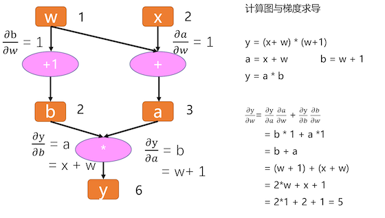

# Pytorch

Pytorch is an optimized tensor library for **deep learning** using GPUs and CPUs.

Summary: Tensors and Dynamic neural networks in Python with strong GPU acceleration.

## 常用流程

### 操作数据

```py
import torch
from torch import nn
from torch.utils.data import DataLoader
from torchvision import datasets
from torchvision.transforms import ToTensor

# Download training data from open datasets.
training_data = datasets.FashionMNIST(
  root="data",
  train=True,
  download=True,
  transform=ToTensor(),
)

# Download test data from open datasets.
test_data = datasets.FashionMNIST(
  root="data",
  train=False,
  download=True,
  transform=ToTensor(),
)

batch_size = 64

# Create data loaders.
train_dataloader = DataLoader(training_data, batch_size=batch_size)
test_dataloader = DataLoader(test_data, batch_size=batch_size)

for X, y in test_dataloader:
  print(f"Shape of X [N, C, H, W]: {X.shape}")
  print(f"Shape of y: {y.shape} {y.dtype}")
  break

```

### 创建模型

```py
device = torch.accelerator.current_accelerator().type if torch.accelerator.is_available() else "cpu"
print(f"Using {device} device")

# Define model
class NeuralNetwork(nn.Module):
  def __init__(self):
    super().__init__()
    self.flatten = nn.Flatten()
    self.linear_relu_stack = nn.Sequential(
      nn.Linear(28*28, 512),
      nn.ReLU(),
      nn.Linear(512, 512),
      nn.ReLU(),
      nn.Linear(512, 10)
    )

  def forward(self, x):
    x = self.flatten(x)
    logits = self.linear_relu_stack(x)
    return logits

model = NeuralNetwork().to(device)
print(model)
```

### 优化参数

```py
loss_fn = nn.CrossEntropyLoss()
optimizer = torch.optim.SGD(model.parameters(), lr=1e-3)

def train(dataloader, model, loss_fn, optimizer):
  size = len(dataloader.dataset)
  model.train()
  for batch, (X, y) in enumerate(dataloader):
    X, y = X.to(device), y.to(device)

    # Compute prediction error
    pred = model(X)
    loss = loss_fn(pred, y)

    # Backpropagation
    loss.backward()
    optimizer.step()
    optimizer.zero_grad()

    if batch % 100 == 0:
      loss, current = loss.item(), (batch + 1) * len(X)
      print(f"loss: {loss:>7f}  [{current:>5d}/{size:>5d}]")

def test(dataloader, model, loss_fn):
  size = len(dataloader.dataset)
  num_batches = len(dataloader)
  model.eval()
  test_loss, correct = 0, 0
  with torch.no_grad():
    for X, y in dataloader:
      X, y = X.to(device), y.to(device)
      pred = model(X)
      test_loss += loss_fn(pred, y).item()
      correct += (pred.argmax(1) == y).type(torch.float).sum().item()
  test_loss /= num_batches
  correct /= size
  print(f"Test Error: \n Accuracy: {(100*correct):>0.1f}%, Avg loss: {test_loss:>8f} \n")

epochs = 5
for t in range(epochs):
  print(f"Epoch {t+1}\n-------------------------------")
  train(train_dataloader, model, loss_fn, optimizer)
  test(test_dataloader, model, loss_fn)
print("Done!")
```

### 保存/重载

```py
# 保存
torch.save(model.state_dict(), "model.pth")
print("Saved PyTorch Model State to model.pth")

# 重载
model = NeuralNetwork().to(device)
model.load_state_dict(torch.load("model.pth", weights_only=True))
```

### 测试一下

```py
classes = [
    "T-shirt/top",
    "Trouser",
    "Pullover",
    "Dress",
    "Coat",
    "Sandal",
    "Shirt",
    "Sneaker",
    "Bag",
    "Ankle boot",
]

model.eval()
x, y = test_data[0][0], test_data[0][1]
with torch.no_grad():
  x = x.to(device)
  pred = model(x)
  predicted, actual = classes[pred[0].argmax(0)], classes[y]
  print(f'Predicted: "{predicted}", Actual: "{actual}"')

# Predicted: "Ankle boot", Actual: "Ankle boot"
```

## 计算图与自动求导

计算图（`Computational Graphs`）是一种描述运算的「语言」，它由`节点(Node)`和`边(Edge)`构成。记录所有节点和边的信息，可以方便地完成**自动求导**。

- **节点**：表示数据和计算操作。
- **边**：表示数据流向。


如图：w=1，x=2 时，y 对 w 的导数为 5。

**叶子节点**

w、x 称为**叶子节点**。叶子结点是最基础结点，其数据不是由运算生成的，因此是整个计算图的基石，是不可轻易”修改“的。而最终计算得到的 y 就是根节点，就像一棵树一样，叶子在上面，根在下面。

**梯度保留**

只有**叶子节点的梯度**得到**保留**，中间变量的梯度默认不保留；在 Pytorch 中，非叶子结点的梯度在反向传播结束之后就会被释放掉，如果需要保留的话可以对该结点设置 `retain_grad()`。

**静态图和动态图**

计算图根据计算图的搭建方式可以划分为**静态图和动态图**。Pytorch 是典型的动态图机制，TensorFlow 是静态图机制（TF 2.x 也支持动态图模式）。

## VSCode Debugger 调试源码

- 1、在目标代码处，设置断点 breakpoint。
- 2、点击 VSCode 左边栏的「甲壳虫+播放」按钮，并创建调试配置文件(create a launch.json)。
- 3、**添加、添加、添加一行 `"justMyCode": false`**。

`VSCode`个坑爹的玩意儿，**默认没有`justMyCode`这个`key`，那就是 `True`**。老子调了好久都进不去 `torch` 源码，靠，满头大汗。微软是个大傻逼。

```json {13}
{
  // Use IntelliSense to learn about possible attributes.
  // Hover to view descriptions of existing attributes.
  // For more information, visit: https://go.microsoft.com/fwlink/?linkid=830387
  "version": "0.2.0",
  "configurations": [
    {
      "name": "Python Debugger: Current File",
      "type": "debugpy",
      "request": "launch",
      "program": "${file}",
      "console": "integratedTerminal",
      "justMyCode": false
    }
  ]
}
```

## 方法简介

### unsqueeze

PyTorch 中用于在张量指定位置**添加一个新维度**的方法。

- unsqueeze：非原地操作，返回新张量，不修改原张量。
- unsqueeze\_：原地操作，修改原张量本身。
