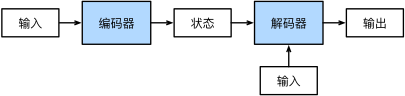
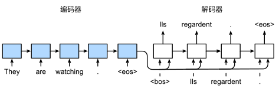
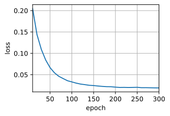

# 现代循环神经网络

## 门控机制

### 长短期记忆网络(LSTM)

LSTM：long short-term memory。

可以认为 LSTM 的核心创新就是引入了`Cell State`（细胞状态）这个"全局记忆通道"，而 GRU 可以看作是对 LSTM 的简化版本。


核心组件：

- **遗忘门(Forget Gate, f)**：决定丢弃哪些信息。
- **输入门(Input Gate, i)**：决定更新哪些信息。
- **输出门(Output Gate, o)**：决定输出哪些信息。
- **细胞状态(Cell State, C)**：长期记忆通道。

长短期记忆网络的隐藏层输出包括“隐状态”和“记忆元”。只有隐状态会传递到输出层，而记忆元完全属于内部信息。

### 门控循环单元(GRU)

GRU：Gated Recurrent Unit。

普通循环神经网络之相比，门控循环单元与支持**隐状态门控**，是简化版的 LSTM。

这意味着模型有专门的机制来确定应该**何时更新隐状态，以及应该何时重置隐状态。这些机制是可学习的**。例如，如果第一个词元非常重要，模型将学会在第一次观测之后不更新隐状态。同样，模型也可以学会跳过不相关的临时观测。

它通过引入可学习的"门"来控制信息流动，决定哪些信息应该被保留、哪些应该被遗忘。


核心组件：

- **重置门(Reset Gate, r)**：控制前一时刻隐藏状态有多少信息需要被"遗忘"。
- **更新门(Update Gate, z)**：控制新状态中有多少来自前一状态，有多少来自当前计算的新候选状态。

重置门打开时，门控循环单元包含基本循环神经网络；更新门打开时，门控循环单元可以跳过子序列。

### 对比与现代改进方向

| 机制       | GRU                        | LSTM                             |
| ---------- | -------------------------- | -------------------------------- |
| 门数量     | 2 个(更新门、重置门)       | 3 个(输入门、遗忘门、输出门)     |
| 状态变量   | 只有隐藏状态 h             | 隐藏状态 h + 细胞状态 C          |
| 参数数量   | 较少(约少 1/3)             | 较多                             |
| 计算复杂度 | 较低                       | 较高                             |
| 信息流     | 直接通过隐藏状态传递       | 通过细胞状态和隐藏状态双通道传递 |
| 性能表现   | 简单任务表现好，资源消耗低 | 复杂任务表现更稳定               |

现代最新架构（如 `Transformer`）实际上吸收了这两种思想的优点：

- LSTM 思想：通过残差连接实现"记忆高速公路"
- GRU 思想：简化门控机制（如 Transformer 中的 FFN 层）

## 编码器-解码器架构


编码器-解码器（`encoder-decoder`）架构两个主要组件：

1. **编码器**（encoder）：接受长度可变序列作为输入，并将其转换为具有固定形状编码状态。
2. **解码器**（decoder）：将固定形状编码状态映射到长度可变序列。

“编码器－解码器”架构可以将长度可变的序列作为输入和输出，因此适用于**机器翻译**等序列转换问题。

### 编码器

```py
from torch import nn
class Encoder(nn.Module):
  def __init__(self, **kwargs):
    super(Encoder, self).__init__(**kwargs)

  def forward(self, X, *args):
    raise NotImplementedError
```

### 解码器

```py
class Decoder(nn.Module):
  def __init__(self, **kwargs):
    super(Decoder, self).__init__(**kwargs)

  def init_state(self, enc_outputs, *args):
    raise NotImplementedError

  def forward(self, X, state):
    raise NotImplementedError
```

init_state 函数，用于将编码器的输出(`enc_outputs`)转换为编码后的状态。注意，此步骤可能需要额外的输入，例如：输入序列的有效长度。为了逐个地生成长度可变的词元序列，解码器在每个时间步都会将输入(例如：在前一时间步生成的词元)和编码后的状态映射成当前时间步的输出词元。

### 合并

```py
class EncoderDecoder(nn.Module):
  def __init__(self, encoder, decoder, **kwargs):
    super(EncoderDecoder, self).__init__(**kwargs)
    self.encoder = encoder
    self.decoder = decoder

  def forward(self, enc_X, dec_X, *args):
    enc_outputs = self.encoder(enc_X, *args)
    dec_state = self.decoder.init_state(enc_outputs, *args)
    return self.decoder(dec_X, dec_state)
```

“编码器-解码器”架构包含了一个编码器和一个解码器，并且还拥有可选的额外的参数。在前向传播中，编码器的输出用于生成编码状态，这个状态又被解码器作为其输入的一部分。

## 序列到序列学习(seq2seq)

seq2seq：sequence to sequence。


上图是机器翻译中使用两个循环神经网络进行序列到序列学习。特定的`“<eos>”`表示序列结束词元。一旦输出序列生成此词元，模型就会停止预测。

在循环神经网络解码器的初始化时间步，有两个特定的设计决定：首先，特定的`“<bos>”`表示序列开始词元，它是解码器的输入序列的第一个词元。其次，使用循环神经网络编码器最终的隐状态来初始化解码器的隐状态。

### 用 RNN 实现编码器

```py
import collections
import math
import torch
from torch import nn
from d2l import torch as d2l

# 用于序列到序列学习的循环神经网络编码器
class Seq2SeqEncoder(d2l.Encoder):
  def __init__(self, vocab_size, embed_size, num_hiddens, num_layers, dropout=0, **kwargs):
    super(Seq2SeqEncoder, self).__init__(**kwargs)
    # 嵌入层
    self.embedding = nn.Embedding(vocab_size, embed_size)
    self.rnn = nn.GRU(embed_size, num_hiddens, num_layers, dropout=dropout)

  def forward(self, X, *args):
    # 输出'X'的形状：(batch_size,num_steps,embed_size)
    X = self.embedding(X)
    # 在循环神经网络模型中，第一个轴对应于时间步
    X = X.permute(1, 0, 2)
    # 如果未提及状态，则默认为0
    output, state = self.rnn(X)
    # output的形状:(num_steps,batch_size,num_hiddens)
    # state的形状:(num_layers,batch_size,num_hiddens)
    return output, state
```

**嵌入层**(`embedding layer`，`nn.Embedding`)，用以获得输入序列中每个词元的特征向量。

嵌入层的权重是一个矩阵，其行数是输入词表大小(`vocab_size`)，其列数是特征向量维度(`embed_size`)。对于任意输入词元索引 $i$，嵌入层获取权重矩阵第 $i$ 行(`从0开始`)以返回其特征向量。

```py
encoder = Seq2SeqEncoder(vocab_size=10, embed_size=8, num_hiddens=16, num_layers=2)
encoder.eval()
X = torch.zeros((4, 7), dtype=torch.long)
output, state = encoder(X)
output.shape, state.shape

# (torch.Size([7, 4, 16]), torch.Size([2, 4, 16]))
```

:::tip 参数制约
`embed_size << vocab_size`，如大小接近，或导致参数量爆炸、过拟合。比率：`1/10 到 1/100`。  
`num_hiddens >= embed_size`，确保隐藏层有足够容量融合时序信息和输入特征。比率：`num_hiddens = 2~4 × embed_size`。
:::

最后一层的隐状态的输出是一个张量（output 由编码器的循环层返回），其形状为（时间步数，批量大小，隐藏单元数）。最后一个时间步的多层隐状态的形状是（隐藏层的数量，批量大小，隐藏单元的数量）。如果使用长短期记忆网络，`state`中还将包含记忆单元信息。

### 实现解码器

```py
# 用于序列到序列学习的循环神经网络解码器
class Seq2SeqDecoder(d2l.Decoder):
  def __init__(self, vocab_size, embed_size, num_hiddens, num_layers, dropout=0, **kwargs):
    super(Seq2SeqDecoder, self).__init__(**kwargs)
    self.embedding = nn.Embedding(vocab_size, embed_size)
    self.rnn = nn.GRU(embed_size + num_hiddens, num_hiddens, num_layers, dropout=dropout)
    self.dense = nn.Linear(num_hiddens, vocab_size)

  def init_state(self, enc_outputs, *args):
    return enc_outputs[1]

  def forward(self, X, state):
    # 输出'X'的形状：(batch_size,num_steps,embed_size)
    X = self.embedding(X).permute(1, 0, 2)
    # 广播context，使其具有与X相同的num_steps
    context = state[-1].repeat(X.shape[0], 1, 1)
    X_and_context = torch.cat((X, context), 2)
    output, state = self.rnn(X_and_context, state)
    output = self.dense(output).permute(1, 0, 2)
    # output的形状:(batch_size,num_steps,vocab_size)
    # state的形状:(num_layers,batch_size,num_hiddens)
    return output, state
```

实现解码器时，我们直接使用**编码器最后一个时间步**的隐状态来**初始化解码器**的隐状态，解码器的最后一层使用全连接层来变换隐状态。

```py
decoder = Seq2SeqDecoder(vocab_size=10, embed_size=8, num_hiddens=16, num_layers=2)
decoder.eval()
state = decoder.init_state(encoder(X))
output, state = decoder(X, state)
output.shape, state.shape
# (torch.Size([4, 7, 10]), torch.Size([2, 4, 16]))
```

### 实现损失函数

应该将**填充词元**的预测排除在损失函数的计算之外。通过零值化屏蔽不相关的项，以便后面任何不相关预测的计算都是与零的乘积，结果都等于零。

```py
# 在序列中屏蔽不相关
def sequence_mask(X, valid_len, value=0):
  maxlen = X.size(1)
  mask = torch.arange((maxlen), dtype=torch.float32, device=X.device)[None, :] < valid_len[:, None]
  X[~mask] = value
  return X

# 带遮蔽的softmax交叉熵损失
class MaskedSoftmaxCELoss(nn.CrossEntropyLoss):
  # pred的形状：(batch_size,num_steps,vocab_size)
  # label的形状：(batch_size,num_steps)
  # valid_len的形状：(batch_size,)
  def forward(self, pred, label, valid_len):
    weights = torch.ones_like(label)
    weights = sequence_mask(weights, valid_len)
    self.reduction='none'
    unweighted_loss = super(MaskedSoftmaxCELoss, self).forward(pred.permute(0, 2, 1), label)
    weighted_loss = (unweighted_loss * weights).mean(dim=1)
    return weighted_loss
```

通过扩展 `softmax` 交叉熵损失函数来遮蔽不相关的预测。 最初，所有预测词元的掩码都设置为 1。一旦给定了有效长度，与填充词元对应的掩码将被设置为 0。 最后，将所有词元的损失乘以掩码，以过滤掉损失中填充词元产生的不相关预测。

### 训练(train)

```py
# 训练序列到序列
def train_seq2seq(net, data_iter, lr, num_epochs, tgt_vocab, device):
  def xavier_init_weights(m):
    if type(m) == nn.Linear:
      nn.init.xavier_uniform_(m.weight)
    if type(m) == nn.GRU:
      for param in m._flat_weights_names:
        if "weight" in param:
          nn.init.xavier_uniform_(m._parameters[param])

  net.apply(xavier_init_weights)
  net.to(device)
  optimizer = torch.optim.Adam(net.parameters(), lr=lr)
  loss = MaskedSoftmaxCELoss()
  net.train()
  animator = d2l.Animator(xlabel='epoch', ylabel='loss', xlim=[10, num_epochs])
  for epoch in range(num_epochs):
    timer = d2l.Timer()
    metric = d2l.Accumulator(2)  # 训练损失总和，词元数量
    for batch in data_iter:
      optimizer.zero_grad()
      X, X_valid_len, Y, Y_valid_len = [x.to(device) for x in batch]
      bos = torch.tensor([tgt_vocab['<bos>']] * Y.shape[0], device=device).reshape(-1, 1)
      dec_input = torch.cat([bos, Y[:, :-1]], 1)  # 强制教学
      Y_hat, _ = net(X, dec_input, X_valid_len)
      l = loss(Y_hat, Y, Y_valid_len)
      l.sum().backward()      # 损失函数的标量进行“反向传播”
      d2l.grad_clipping(net, 1)
      num_tokens = Y_valid_len.sum()
      optimizer.step()
      with torch.no_grad():
        metric.add(l.sum(), num_tokens)
    if (epoch + 1) % 10 == 0:
      animator.add(epoch + 1, (metric[0] / metric[1],))
  print(f'loss {metric[0] / metric[1]:.3f}, {metric[1] / timer.stop():.1f} '
      f'tokens/sec on {str(device)}')
```

循环训练过程中，特定序列开始词元（`“<bos>”`）和 原始输出序列（不包括序列结束词元`“<eos>”`） 拼接在一起作为解码器的输入。这被称为**强制教学（teacher forcing）**，因为原始的输出序列（词元的标签）被送入解码器。或者，将来自上一个时间步的预测得到的词元作为解码器的当前输入。

**强制教学**方法将原始输出序列（**而非预测结果**）输入解码器。

```py
embed_size, num_hiddens, num_layers, dropout = 32, 32, 2, 0.1
batch_size, num_steps = 64, 10
lr, num_epochs, device = 0.005, 300, d2l.try_gpu()

train_iter, src_vocab, tgt_vocab = d2l.load_data_nmt(batch_size, num_steps)
encoder = Seq2SeqEncoder(len(src_vocab), embed_size, num_hiddens, num_layers, dropout)
decoder = Seq2SeqDecoder(len(tgt_vocab), embed_size, num_hiddens, num_layers, dropout)
net = d2l.EncoderDecoder(encoder, decoder)
train_seq2seq(net, train_iter, lr, num_epochs, tgt_vocab, device)
# loss 0.019, 12745.1 tokens/sec on cuda:0
```



### 预测(predict)

```py
# 序列到序列模型的预测
def predict_seq2seq(net, src_sentence, src_vocab, tgt_vocab, num_steps,
                    device, save_attention_weights=False):
  # 在预测时将net设置为评估模式
  net.eval()
  src_tokens = src_vocab[src_sentence.lower().split(' ')] + [
      src_vocab['<eos>']]
  enc_valid_len = torch.tensor([len(src_tokens)], device=device)
  src_tokens = d2l.truncate_pad(src_tokens, num_steps, src_vocab['<pad>'])
  # 添加批量轴
  enc_X = torch.unsqueeze(
      torch.tensor(src_tokens, dtype=torch.long, device=device), dim=0)
  enc_outputs = net.encoder(enc_X, enc_valid_len)
  dec_state = net.decoder.init_state(enc_outputs, enc_valid_len)
  # 添加批量轴
  dec_X = torch.unsqueeze(torch.tensor([tgt_vocab['<bos>']], dtype=torch.long, device=device), dim=0)
  output_seq, attention_weight_seq = [], []
  for _ in range(num_steps):
    Y, dec_state = net.decoder(dec_X, dec_state)
    # 我们使用具有预测最高可能性的词元，作为解码器在下一时间步的输入
    dec_X = Y.argmax(dim=2)
    pred = dec_X.squeeze(dim=0).type(torch.int32).item()
    # 保存注意力权重（稍后讨论）
    if save_attention_weights:
      attention_weight_seq.append(net.decoder.attention_weights)
    # 一旦序列结束词元被预测，输出序列的生成就完成了
    if pred == tgt_vocab['<eos>']:
      break
    output_seq.append(pred)
  return ' '.join(tgt_vocab.to_tokens(output_seq)), attention_weight_seq
```

为了采用一个接着一个词元的方式预测输出序列， 每个解码器当前时间步的输入都将来自于前一时间步的预测词元。 与训练类似，序列开始词元（`“<bos>”`） 在初始时间步被输入到解码器中。输出序列的预测遇到序列结束词元（`“<eos>”`）时，预测就结束了。

### 对预测的评估

BLEU（`bilingual evaluation understudy`） 最先是用于评估机器翻译的结果。

$$
\exp \left( \min \left( 0, 1 - \frac{\text{lenlabel}}{\text{lenpred}} \right) \right) \prod_{n=1}^{k} p_n^{1/2^n}
$$

```py
# 计算BLEU
def bleu(pred_seq, label_seq, k):
  pred_tokens, label_tokens = pred_seq.split(' '), label_seq.split(' ')
  len_pred, len_label = len(pred_tokens), len(label_tokens)
  score = math.exp(min(0, 1 - len_label / len_pred))
  for n in range(1, k + 1):
    num_matches, label_subs = 0, collections.defaultdict(int)
    for i in range(len_label - n + 1):
      label_subs[' '.join(label_tokens[i: i + n])] += 1
    for i in range(len_pred - n + 1):
      if label_subs[' '.join(pred_tokens[i: i + n])] > 0:
        num_matches += 1
        label_subs[' '.join(pred_tokens[i: i + n])] -= 1
    score *= math.pow(num_matches / (len_pred - n + 1), math.pow(0.5, n))
  return score
```

### All in

```py
engs = ['go .', "i lost .", 'he\'s calm .', 'i\'m home .']
fras = ['va !', 'j\'ai perdu .', 'il est calme .', 'je suis chez moi .']
for eng, fra in zip(engs, fras):
  translation, attention_weight_seq = predict_seq2seq(
      net, eng, src_vocab, tgt_vocab, num_steps, device)
  print(f'{eng} => {translation}, bleu {bleu(translation, fra, k=2):.3f}')
```
