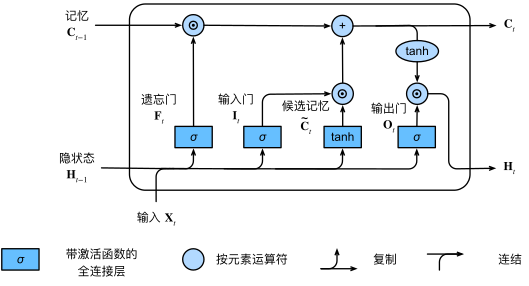

# 现代循环神经网络

## 门控机制

### 长短期记忆网络(LSTM)

LSTM：long short-term memory。

可以认为 LSTM 的核心创新就是引入了`Cell State`（细胞状态）这个"全局记忆通道"，而 GRU 可以看作是对 LSTM 的简化版本。

核心组件：

- **遗忘门(Forget Gate, f)**：决定丢弃哪些信息。
- **输入门(Input Gate, i)**：决定更新哪些信息。
- **输出门(Output Gate, o)**：决定输出哪些信息。
- **细胞状态(Cell State, C)**：长期记忆通道。

长短期记忆网络的隐藏层输出包括“隐状态”和“记忆元”。只有隐状态会传递到输出层，而记忆元完全属于内部信息。

### 门控循环单元(GRU)

GRU：Gated Recurrent Unit。

普通循环神经网络之相比，门控循环单元与支持**隐状态门控**，是简化版的 LSTM。

这意味着模型有专门的机制来确定应该**何时更新隐状态，以及应该何时重置隐状态。这些机制是可学习的**。例如，如果第一个词元非常重要，模型将学会在第一次观测之后不更新隐状态。同样，模型也可以学会跳过不相关的临时观测。

它通过引入可学习的"门"来控制信息流动，决定哪些信息应该被保留、哪些应该被遗忘。

核心组件：

- **重置门(Reset Gate, r)**：控制前一时刻隐藏状态有多少信息需要被"遗忘"。
- **更新门(Update Gate, z)**：控制新状态中有多少来自前一状态，有多少来自当前计算的新候选状态。

重置门打开时，门控循环单元包含基本循环神经网络；更新门打开时，门控循环单元可以跳过子序列。

### 对比与现代改进方向

| 机制       | GRU                        | LSTM                             |
| ---------- | -------------------------- | -------------------------------- |
| 门数量     | 2 个(更新门、重置门)       | 3 个(输入门、遗忘门、输出门)     |
| 状态变量   | 只有隐藏状态 h             | 隐藏状态 h + 细胞状态 C          |
| 参数数量   | 较少(约少 1/3)             | 较多                             |
| 计算复杂度 | 较低                       | 较高                             |
| 信息流     | 直接通过隐藏状态传递       | 通过细胞状态和隐藏状态双通道传递 |
| 性能表现   | 简单任务表现好，资源消耗低 | 复杂任务表现更稳定               |

现代最新架构（如 `Transformer`）实际上吸收了这两种思想的优点：

- LSTM 思想：通过残差连接实现"记忆高速公路"
- GRU 思想：简化门控机制（如 Transformer 中的 FFN 层）
