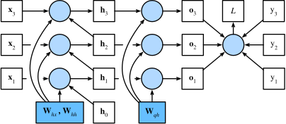

# 循环神经网络(RNN)

**RNN**：Recurrent Neural Network。

到目前为止，我们遇到过两种类型的数据：表格**数据和图像**数据。对于图像数据，我们设计了专门的卷积神经网络架构来为这类特殊的数据结构建模。但若我们对图像中的像素位置进行重排，就会对图像中内容的推断造成极大的困难。

**卷积**神经网络处理**空间信息**，那么**循环神经网络**处理**序列信息**。

循环神经网络通过引入状态变量存储过去的信息和当前的输入，从而可以确定当前的输出。

预测明天的股价要比过去的股价更困难，尽管两者都只是估计一个数字。在统计学中，前者（对超出已知观测范围进行预测）称为**外推法**（`extrapolation`），而后者（在现有观测值之间进行估计）称为**内插法**（`interpolation`）。

:::tip 时间动力学
在深度学习和人工智能（AI）领域，时间动力学（Temporal Dynamics）主要研究**数据或系统状态随时间变化的规律**，以及如何建模、学习和预测这些动态行为。
:::

## 序列模型

### 自回归模型

$$
x_{t} \sim P(x_{t} \mid x_{t-1}, \ldots, x_{1})
$$

自回归模型（`Autoregressive Model`，简称 AR 模型）是一种统计方法，用于分析和预测时间序列数据。

核心思想：**用同一变量过去值来预测未来值**，即认为当前数据点与之前数据点存在**线性关系**。

自回归，是对自己执行回归。相对概念是**多变量时间序列回归**，如向量自回归（VAR, Vector Autoregression）：多个时间序列互相预测，例如用昨天的“气温”和“湿度”联合预测今天的“降水量”。

#### 隐变量自回归模型（latent autoregressive models）


保留一些过去观测总结 $h_t$，同时更新预测 $\hat{x}_t$ 和总结 $h_t$，产生基于 $\hat{x}_t = P(x_t \mid h_t)$ 估计 $x_t$，以及公式 $h_t = g(h_{t-1}, x_{t-1})$ 更新的模型。由于 $h_t$ 从未被观测到，这类模型也被称为**隐变量自回归模型**。

#### 马尔可夫模型

近似法中用 $x_{t-1}, \ldots, x_{t-\tau}$ 而不是 $x_{t-1}, \ldots, x_1$ 来估计 $x_t$ 。只要这种是近似精确的，我们就说序列满足**马尔可夫条件**（Markov condition）。

特别是，如果 $\tau=1$，得到一个一阶马尔可夫模型（first-order Markov model），$P(x)$ 由下式给出：

$$
P(x_1, \ldots, x_T) = \prod_{t=1}^T P(x_t \mid x_{t-1}) \quad \text{当} \quad P(x_1 \mid x_0) = P(x_1)
$$

:::tip 初始条件说明
当 $t=1$，$P(x_1 \mid x_0)$ 中 $x_0$ 不存在(或为初始状态)，故约定 $P(x_1 \mid x_0) = P(x_1)$，即 $x_1$ 的边缘概率。这确保了公式从 $t=1$ 开始时的合法性。
:::

当假设 $x_t$ 仅是离散值时，使用[动态规划](/aiart/deep-learning/basic-concept.html#动态规划)可以沿着[马尔可夫链](/aiart/deep-learning/basic-concept.html#马尔可夫链)精确地计算结果。可以高效地计算 $P(x_{t+1} \mid x_{t-1})$ :

$$
\begin{align*}
P(x_{t+1} \mid x_{t-1}) &= \frac{\sum_{x_t} P(x_{t+1}, x_t, x_{t-1})}{P(x_{t-1})} \\
&= \frac{\sum_{x_t} P(x_{t+1} \mid x_t, x_{t-1}) P(x_t, x_{t-1})}{P(x_{t-1})} \\
&= \sum_{x_t} P(x_{t+1} \mid x_t) P(x_t \mid x_{t-1})
\end{align*}
$$

由此，只需考虑一个非常短的历史：$P(x_{t+1} \mid x_t, x_{t-1}) = P(x_{t+1} \mid x_t)$。

## 文本预处理

### 常见步骤：将字符串顺序转化为数字索引(string order -> number index)

- 1、将文本作为字符串加载到内存中。
- 2、将字符串拆分为**词元**（如单词和字符）。
- 3、建立一个**词表**，将拆分的词元映射到数字索引。
- 4、将文本转换为数字索引序列，方便模型操作。

### 词元化(token)

每个文本序列被拆分成一个词元列表，**词元**是文本的基本单位，每个词元都是一个**字符串**（`string`）。

```py
['the', 'time', 'machine', 'by', 'h', 'g', 'wells']
```

### 词表(vocabulary)

词元的类型是字符串，而模型需要的输入是数字，因此构建一个字典，即**词表**：用来将**字符串**类型的词元**映射**到从
$0$ 开始的**数字索引**中。

将训练集所有文档合并，进行**唯一词元统计**，得到的结果称为**语料(corpus)**。

然后根据每个唯一词元的出现频率，为其分配一个数字索引。很少出现的词元通常被移除，这可以降低复杂性。另外，语料库中不存在或已删除的任何词元都将映射到一个特定的未知词元“`<unk>`”。我们可以选择增加一个列表，用于保存那些被保留的词元，例如：填充词元（“`<pad>`”）、序列开始词元（“`<bos>`”）、序列结束词元（“`<eos>`”）。

```py
[('<unk>', 0), ('the', 1), ('i', 2), ('and', 3), ('of', 4), ('a', 5)]
```

给每座山每条河流取一个温暖的名字，把每一条文本行转换成一个数字索引列表:

```py
文本: ['the', 'time', 'machine', 'by', 'h', 'g', 'wells']
索引: [1, 19, 50, 40, 2183, 2184, 400]
```

## 语言模型

比如 `deep learning niubi` 文本序列的概率是：

$$
P(deep, learning, niubi) = P(deep)P(learning \mid deep)P(niubi \mid deep, learning)
$$

为了训练语言模型，我们需要计算单词的概率，以及给定前面几个单词后出现某个单词的条件概率。这些概率本质上就是语言模型的参数。

## 循环神经网络


循环神经网络（recurrent neural networks，RNNs） 是具有隐状态的神经网络。循环神经网络模型的**参数数量**不会随着时间步的增加而增加。我们可以使用**困惑度**来评价语言模型的质量。

无隐状态的神经网络：

$$
H = \phi(\mathbf{X} \mathbf{W}_{xh} + \mathbf{b}_h)
$$

$$
O = \mathbf{H} \mathbf{W}_{hq} + \mathbf{b}_q
$$

有隐状态的**循环**神经网络：

$$
H_t = \phi(\mathbf{X}_t \mathbf{W}_{xh} + H_{t-1} \mathbf{W}_{hh} + \mathbf{b}_h)
$$

$$
O_t = \mathbf{H}_t \mathbf{W}_{hq} + \mathbf{b}_q
$$

`有隐藏状态`比`无隐藏状态`多了 $H_{t-1} \mathbf{W}_{hh}$，从相邻时间步的隐藏变量 $H_{t}$ 和 $H_{t-1}$ 之间关系可知，这些变量捕获并保留了序列直到其当前时间步的**历史信息**，就如当前时间步下神经网络的状态或**记忆**，因此这样的隐藏变量被称为**隐状态**（`hidden state`）。

由于在当前时间步中，**隐状态使用的定义与前一个时间步中使用的定义相同**，因此**计算是循环**的（`recurrent`）。 于是基于循环计算的隐状态神经网络被命名为**循环神经网络**，执行计算的层 称为**循环层**（`recurrent layer`）。

在任意时间步 $t$，隐状态的计算可以被视为：

- 1、拼接当前时间步 $t$ 的输入 $\mathbf{X}_t$ 和前一时间步 $t-1$ 的隐状态 $\mathbf{H}_{t-1}$；
- 2、将拼接结果送入带有激活函数 $\phi$ 的全连接层，全连接层输出当前时间步 $t$ 的隐状态 $\mathbf{H}_t$。

## 从零实现 RNN

```py
# 1、引入工具包和、加载数据
import math
import torch
from torch import nn
from torch.nn import functional as F
from d2l import torch as d2l

batch_size, num_steps = 32, 35
train_iter, vocab = d2l.load_data_time_machine(batch_size, num_steps)

# 2、参数初始化
def get_params(vocab_size, num_hiddens, device):
  num_inputs = num_outputs = vocab_size

  def normal(shape):
    return torch.randn(size=shape, device=device) * 0.01

  # 隐藏层参数
  W_xh = normal((num_inputs, num_hiddens))
  W_hh = normal((num_hiddens, num_hiddens))
  b_h = torch.zeros(num_hiddens, device=device)
  # 输出层参数
  W_hq = normal((num_hiddens, num_outputs))
  b_q = torch.zeros(num_outputs, device=device)
  # 附加梯度
  params = [W_xh, W_hh, b_h, W_hq, b_q]
  for param in params:
    param.requires_grad_(True)
  return params

# 3、建模
def init_rnn_state(batch_size, num_hiddens, device):
  return (torch.zeros((batch_size, num_hiddens), device=device), )

def rnn(inputs, state, params):
  # inputs的形状：(时间步数量，批量大小，词表大小)
  W_xh, W_hh, b_h, W_hq, b_q = params
  H, = state
  outputs = []
  # X的形状：(批量大小，词表大小)
  for X in inputs:
    H = torch.tanh(torch.mm(X, W_xh) + torch.mm(H, W_hh) + b_h)
    Y = torch.mm(H, W_hq) + b_q
    outputs.append(Y)
  return torch.cat(outputs, dim=0), (H,)

class RNNModelScratch:
  def __init__(self, vocab_size, num_hiddens, device, get_params, init_state, forward_fn):
    self.vocab_size, self.num_hiddens = vocab_size, num_hiddens
    self.params = get_params(vocab_size, num_hiddens, device)
    self.init_state, self.forward_fn = init_state, forward_fn

  def __call__(self, X, state):
    X = F.one_hot(X.T, self.vocab_size).type(torch.float32)
    return self.forward_fn(X, state, self.params)

  def begin_state(self, batch_size, device):
    return self.init_state(batch_size, self.num_hiddens, device)

# 4、模型初始化
num_hiddens = 512
net = RNNModelScratch(len(vocab), num_hiddens, d2l.try_gpu(), get_params, init_rnn_state, rnn)
state = net.begin_state(X.shape[0], d2l.try_gpu())
Y, new_state = net(X.to(d2l.try_gpu()), state)
Y.shape, len(new_state), new_state[0].shape

# 5、预测：在prefix后面生成新字符
def predict_ch8(prefix, num_preds, net, vocab, device):
  state = net.begin_state(batch_size=1, device=device)
  outputs = [vocab[prefix[0]]]
  get_input = lambda: torch.tensor([outputs[-1]], device=device).reshape((1, 1))
  for y in prefix[1:]:  # 预热期
    _, state = net(get_input(), state)
    outputs.append(vocab[y])
  for _ in range(num_preds):  # 预测num_preds步
    y, state = net(get_input(), state)
    outputs.append(int(y.argmax(dim=1).reshape(1)))
  return ''.join([vocab.idx_to_token[i] for i in outputs])

# 6、训练
def train_epoch_ch8(net, train_iter, loss, updater, device, use_random_iter):
  state, timer = None, d2l.Timer()
  metric = d2l.Accumulator(2)  # 训练损失之和,词元数量
  for X, Y in train_iter:
    if state is None or use_random_iter:
      # 在第一次迭代或使用随机抽样时初始化state
      state = net.begin_state(batch_size=X.shape[0], device=device)
    else:
      if isinstance(net, nn.Module) and not isinstance(state, tuple):
        # state对于nn.GRU是个张量
        state.detach_()
      else:
        # state对于nn.LSTM或对于我们从零开始实现的模型是个张量
        for s in state:
          s.detach_()
    y = Y.T.reshape(-1)
    X, y = X.to(device), y.to(device)
    y_hat, state = net(X, state)
    l = loss(y_hat, y.long()).mean()
    if isinstance(updater, torch.optim.Optimizer):
      updater.zero_grad()
      l.backward()
      grad_clipping(net, 1)
      updater.step()
    else:
      l.backward()
      grad_clipping(net, 1)
      # 因为已经调用了mean函数
      updater(batch_size=1)
    metric.add(l * y.numel(), y.numel())
  return math.exp(metric[0] / metric[1]), metric[1] / timer.stop()
```

### 梯度剪裁

对于长度为 $T$ 的序列，我们在迭代中计算这 $T$个时间步上的梯度，将会在反向传播过程中产生长度为 $O(T)$ 的矩阵乘法链。当 $T$ 较大时，它可能导致数值不稳定，例如可能导致梯度爆炸或梯度消失。

有时**梯度很大**，从而优化算法可能**无法收敛**。一个流行的替代方案是通过将梯度 $\mathbf{g}$ 投影回给定半径(如 $\theta$)的球来**裁剪梯度**。如下式：

$$
\mathbf{g} \gets \min\left(1, \frac{\theta}{\|\mathbf{g}\|}\right) \mathbf{g}
$$

```py
def grad_clipping(net, theta):
  if isinstance(net, nn.Module):
    params = [p for p in net.parameters() if p.requires_grad]
  else:
    params = net.params
  norm = torch.sqrt(sum(torch.sum((p.grad ** 2)) for p in params))
  if norm > theta:
    for param in params:
      param.grad[:] *= theta / norm
```

### 小结

- 循环神经网络模型在训练以前需要初始化状态，不过**随机抽样和顺序划分**使用初始化方法不同。当使用顺序划分时，我们需要分离梯度以减少计算量。
- 在进行任何预测之前，模型通过**预热期**进行自我更新（例如，获得比初始值更好的隐状态）。
- 梯度裁剪可以防止梯度爆炸，但不能应对**梯度消失**。

### 梯度冲突、梯度分离与梯度投影

**梯度冲突**（`Gradient Conflict`）是深度学习中多任务学习、多模块联合训练或共享参数优化时常见的问题，指不同任务或模块的梯度方向不一致（甚至相反），导致模型参数更新时相互干扰，最终降低整体性能。

当多个任务（或损失函数）共享同一组模型参数时，它们的梯度方向可能相反或夹角过大（如余弦相似度为负），导致参数更新时“左右为难”。

造成模型难以收敛，训练过程震荡。某些任务主导优化方向，其他任务性能下降（被“压制”）。

检测冲突可用**余弦相似度**计算不同任务梯度的夹角(方向一致性)。若接近`-1`说明冲突严重，接近`1`则方向一致。

$$
\cos(\theta) = \frac{\mathbf{g_1} \cdot \mathbf{g_2}}{\|\mathbf{g_1}\| \|\mathbf{g_2}\|}
$$

解决方法之**梯度分离**（`Gradient Decoupling`）：

- **手动分离**：对特定任务或模块的梯度阻断（如`detach()`）。
- **梯度投影**（如 PCGrad）：若任务 A 和 B 梯度冲突，将 B 梯度投影到 A 梯度正交方向上。

**梯度投影**（`Gradient Projection`）是一种直接解决梯度冲突的方法，核心思想是通过数学手段调整冲突梯度的方向，保留梯度的**正交分量**，避免反向抵消。

当多个任务的梯度方向冲突时（如余弦相似度为负），将冲突任务的梯度投影到另一任务梯度的正交补空间上，消除反向分量，仅保留不与其他任务梯度冲突的部分。

**以 PCGrad 为例**（《Gradient Surgery for Multi-Task Learning》）是经典梯度投影算法，步骤如下：

- 1：计算任务梯度

假设有任务 A 和任务 B，其损失函数为 $L_A$ 和 $L_B$，共享参数 $\theta$，分别计算梯度：

$$
\mathbf{g}_A = \nabla_\theta L_A, \quad \mathbf{g_B} = \nabla_\theta L_B
$$

- 2：检测冲突

计算梯度夹角余弦值：

$$
\cos(\theta) = \frac{\mathbf{g_A} \cdot \mathbf{g_B}}{\|\mathbf{g_A}\| \|\mathbf{g_B}\|}
$$

若 $\cos(\theta) < 0$（夹角大于 90°），说明梯度冲突。

- 3：梯度投影

对任务 B 的梯度 $\mathbf{g}_B$ 进行投影，消除与 $\mathbf{g}_A$ 冲突的分量：

$$
\mathbf{g}_B' = \mathbf{g_B} - \frac{\mathbf{g_A} \cdot \mathbf{g_B}}{\|\mathbf{g_A}\|^2} \mathbf{g_A}
$$

几何意义：将 $\mathbf{g}_B$ 投影到 $\mathbf{g}_A$ 的正交方向上，保留不与 $\mathbf{g}_A$ 冲突的部分。

- 4：更新参数

使用修正后的梯度更新参数：

$$
\theta \leftarrow \theta - \eta (\mathbf{g_A} + \mathbf{g}_B')
$$

### 小结

| 特性         | 梯度剪裁       | 梯度分离             |
| ------------ | -------------- | -------------------- |
| **目标**     | 控制梯度幅值   | 解耦梯度来源或方向   |
| **应用场景** | 梯度爆炸       | 多任务/模块冲突      |
| **操作对象** | 全局或局部梯度 | 特定参数或任务的梯度 |
| **实现方式** | 数值截断或缩放 | 梯度阻断或方向调整   |

## 简洁实现 RNN

```py
import torch
from torch import nn
from torch.nn import functional as F
from d2l import torch as d2l

batch_size, num_steps = 32, 35
train_iter, vocab = d2l.load_data_time_machine(batch_size, num_steps)

num_hiddens = 256
rnn_layer = nn.RNN(len(vocab), num_hiddens)

state = torch.zeros((1, batch_size, num_hiddens))
state.shape

X = torch.rand(size=(num_steps, batch_size, len(vocab)))
Y, state_new = rnn_layer(X, state)
Y.shape, state_new.shape

class RNNModel(nn.Module):
  def __init__(self, rnn_layer, vocab_size, **kwargs):
    super(RNNModel, self).__init__(**kwargs)
    self.rnn = rnn_layer
    self.vocab_size = vocab_size
    self.num_hiddens = self.rnn.hidden_size
    # 如果RNN是双向的（之后将介绍），num_directions应该是2，否则应该是1
    if not self.rnn.bidirectional:
      self.num_directions = 1
      self.linear = nn.Linear(self.num_hiddens, self.vocab_size)
    else:
      self.num_directions = 2
      self.linear = nn.Linear(self.num_hiddens * 2, self.vocab_size)

  def forward(self, inputs, state):
    X = F.one_hot(inputs.T.long(), self.vocab_size)
    X = X.to(torch.float32)
    Y, state = self.rnn(X, state)
    # 全连接层首先将Y的形状改为(时间步数*批量大小,隐藏单元数)
    # 它的输出形状是(时间步数*批量大小,词表大小)。
    output = self.linear(Y.reshape((-1, Y.shape[-1])))
    return output, state

  def begin_state(self, device, batch_size=1):
    if not isinstance(self.rnn, nn.LSTM):
      # nn.GRU以张量作为隐状态
      return  torch.zeros((self.num_directions * self.rnn.num_layers,
                            batch_size, self.num_hiddens), device=device)
    else:
      # nn.LSTM以元组作为隐状态
      return (torch.zeros((
        self.num_directions * self.rnn.num_layers, batch_size, self.num_hiddens), device=device),
            torch.zeros((self.num_directions * self.rnn.num_layers,
                batch_size, self.num_hiddens), device=device))
```

## 通过时间反向传播

**通过时间反向传播（Backpropagation Through Time, BPTT）** 是用于训练循环神经网络（RNN）的一种梯度下降算法。它是标准反向传播（BP）在时间序列数据上的扩展，专门处理 RNN 中随时间展开的网络结构。

BPTT 是 RNN 的核心训练算法，通过时间维度上的梯度传播，使模型能够学习序列数据中的时序模式。


上图表示具有三个时间步的循环神经网络模型依赖关系的计算图。未着色的方框表示变量，着色的方框表示参数，圆表示运算符。

### 举个例子

假设 RNN 处理句子 "_I love NLP_"，BPTT 会：

- 展开为 3 个时间步（每个词对应一步）。
- 反向传播时，梯度从 "_NLP_" 传递到 "_love_" 再到 "_I_"，调整参数以捕捉序列依赖。

### 与标准 BP 的区别

- **时间维度**：BPTT 需处理梯度跨时间步的传播，而 BP 仅在固定网络结构内传播。
- **参数共享**：RNN 的同一参数在所有时间步重复使用，梯度需累加。

### 挑战

- **长程依赖**：梯度可能随时间步指数衰减（消失）或增长（爆炸），导致难以学习长期模式。
- **计算成本**：长序列需展开大量时间步，占用内存。

### 解决方案

- **截断 BPTT（Truncated BPTT）**：限定反向传播的时间步数，平衡计算效率和长程依赖。
- **LSTM/GRU**：通过门控机制缓解梯度消失问题。
