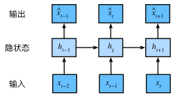

# 循环神经网络(RNN)

**RNN**：Recurrent Neural Network。

到目前为止，我们遇到过两种类型的数据：表格**数据和图像**数据。对于图像数据，我们设计了专门的卷积神经网络架构来为这类特殊的数据结构建模。但若我们对图像中的像素位置进行重排，就会对图像中内容的推断造成极大的困难。

**卷积**神经网络处理**空间信息**，那么**循环神经网络**处理**序列信息**。

循环神经网络通过引入状态变量存储过去的信息和当前的输入，从而可以确定当前的输出。

预测明天的股价要比过去的股价更困难，尽管两者都只是估计一个数字。在统计学中，前者（对超出已知观测范围进行预测）称为**外推法**（`extrapolation`），而后者（在现有观测值之间进行估计）称为**内插法**（`interpolation`）。

:::tip 时间动力学
在深度学习和人工智能（AI）领域，时间动力学（Temporal Dynamics）主要研究**数据或系统状态随时间变化的规律**，以及如何建模、学习和预测这些动态行为。
:::

## 序列模型

### 自回归模型

$$
x_{t} \sim P(x_{t} \mid x_{t-1}, \ldots, x_{1})
$$

自回归模型（`Autoregressive Model`，简称 AR 模型）是一种统计方法，用于分析和预测时间序列数据。

核心思想：**用同一变量过去值来预测未来值**，即认为当前数据点与之前数据点存在**线性关系**。

自回归，是对自己执行回归。相对概念是**多变量时间序列回归**，如向量自回归（VAR, Vector Autoregression）：多个时间序列互相预测，例如用昨天的“气温”和“湿度”联合预测今天的“降水量”。

#### 隐变量自回归模型（latent autoregressive models）

保留一些过去观测总结 $h_t$，同时更新预测 $\hat{x}_t$ 和总结 $h_t$，产生基于 $\hat{x}_t = P(x_t \mid h_t)$ 估计 $x_t$，以及公式 $h_t = g(h_{t-1}, x_{t-1})$ 更新的模型。由于 $h_t$ 从未被观测到，这类模型也被称为**隐变量自回归模型**。

#### 马尔可夫模型

近似法中用 $x_{t-1}, \ldots, x_{t-\tau}$ 而不是 $x_{t-1}, \ldots, x_1$ 来估计 $x_t$ 。只要这种是近似精确的，我们就说序列满足**马尔可夫条件**（Markov condition）。

特别是，如果 $\tau=1$，得到一个一阶马尔可夫模型（first-order Markov model），$P(x)$ 由下式给出：

$$
P(x_1, \ldots, x_T) = \prod_{t=1}^T P(x_t \mid x_{t-1}) \quad \text{当} \quad P(x_1 \mid x_0) = P(x_1)
$$

:::tip 初始条件说明
当 $t=1$，$P(x_1 \mid x_0)$ 中 $x_0$ 不存在(或为初始状态)，故约定 $P(x_1 \mid x_0) = P(x_1)$，即 $x_1$ 的边缘概率。这确保了公式从 $t=1$ 开始时的合法性。
:::

当假设 $x_t$ 仅是离散值时，使用[动态规划](/aiart/deep-learning/basic-concept.html#动态规划)可以沿着[马尔可夫链](/aiart/deep-learning/basic-concept.html#马尔可夫链)精确地计算结果。可以高效地计算 $P(x_{t+1} \mid x_{t-1})$ :

$$
\begin{align*}
P(x_{t+1} \mid x_{t-1}) &= \frac{\sum_{x_t} P(x_{t+1}, x_t, x_{t-1})}{P(x_{t-1})} \\
&= \frac{\sum_{x_t} P(x_{t+1} \mid x_t, x_{t-1}) P(x_t, x_{t-1})}{P(x_{t-1})} \\
&= \sum_{x_t} P(x_{t+1} \mid x_t) P(x_t \mid x_{t-1})
\end{align*}
$$

由此，只需考虑一个非常短的历史：$P(x_{t+1} \mid x_t, x_{t-1}) = P(x_{t+1} \mid x_t)$。
