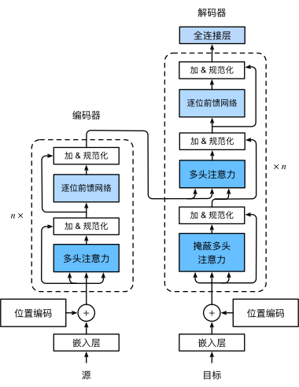

# Transformer 架构

自注意力同时具有**并行计算**和**最短最大路径长度**这两个优势，因此使用自注意力来设计深度架构是很有吸引力的。

`Transformer` 模型**完全基于注意力机制**，没有任何卷积层或循环神经网络层。

尽管 `Transformer` 最初是应用于在**文本数据**上的序列到序列学习，但现在已经推广到各种现代的深度学习中，例如**语言、视觉、语音和强化学习**领域。

## 模型


Transformer 是**编码器－解码器**架构实例，基于**自注意力模块叠加**而成。

**源序列**(输入)嵌入<sup>embedding</sup>，和**目标序列**(输出)嵌入加上**位置编码**<sup>positional encoding</sup>，分别输入到编码器和解码器中。

**编码器**：由多个相同层叠加而成的，**每个层都有两个子层**。

- 第一个子层：**多头自注意力**<sup>multi-head self-attention</sup>汇聚。
- 第二个子层：**逐位前馈网络**<sup>positionwise feed-forward network：FFN</sup>。
- 计算时，查询、键和值都**来自前一个编码器**层输出，每个子层都采用了**残差连接**<sup>residual connection</sup>，在残差连接加法计算后，应用**层规范化**<sup>layer normalization</sup>。

**解码器**：也是由多个相同层叠加而成，同样使用了**残差连接**和**层规范化**。

- 第三个子层：插入在这两个子层之间，称为**编码器－解码器注意力**<sup>encoder-decoder attention</sup>层：**查询**来自**前一个解码器**层输出，而**键和值**来自**整个编码器**输出。
- **解码器自注意力**中，查询、键和值都来**自上一个解码器**层输出。但解码器中每个位置只能考虑该位置之前的所有位置。这种**掩蔽**<sup>masked</sup>注意力保留了[**自回归**<sup>auto-regressive</sup>](/aiart/deep-learning/rnn.html#自回归模型)属性，确保预测仅依赖于已生成的输出词元。

## 基于位置的前馈网络

```py
class PositionWiseFFN(nn.Module):
  def __init__(self, ffn_num_input, ffn_num_hiddens, ffn_num_outputs, **kwargs):
    super(PositionWiseFFN, self).__init__(**kwargs)
    self.dense1 = nn.Linear(ffn_num_input, ffn_num_hiddens)
    self.relu = nn.ReLU()
    self.dense2 = nn.Linear(ffn_num_hiddens, ffn_num_outputs)

  def forward(self, X):
    return self.dense2(self.relu(self.dense1(X)))

# 实例化
ffn = PositionWiseFFN(4, 4, 8)
```

- 在标准 `Transformer` 中，`ffn_num_outputs` 通常与模型主维度（如输入维度）一致，而隐藏层是主维度 4 倍（如输入 512 → 隐藏层 2048）。
- 本例输出维度（8）与输入（4）不同，或破坏残差连接条件（需 `输入维度 == 输出维度`）。

### 基于位置

`nn.Linear` 默认行为：**位置独立**计算，不混合不同位置信息。

- 当输入是 (`B`=batch_size, `T`=sequence_length, `D_in`=输入特征维度) 时，对 `T` 的每个位置独立计算，即 "位置相关"。

| 层类型               | 位置独立 | 原因                                  |
| -------------------- | -------- | ------------------------------------- |
| `nn.Linear`          | ✅ 是    | 默认独立处理 `(B, T, D)` 中每个 `T`。 |
| `nn.Conv1d`          | ❌ 否    | 滑动窗口混合相邻位置的信息。          |
| `nn.LSTM`            | ❌ 否    | 隐状态依赖前序位置的计算结果。        |
| `MultiHeadAttention` | ❌ 否    | 显式计算所有位置间的注意力权重。      |
| `PositionWiseFFN`    | ✅ 是    | `nn.Linear` 堆叠，独立处理每个位置。  |

### 前馈网络

**前馈网络**<sup>Feedforward Neural Network, FNN</sup> 是一种最基本神经网络结构。其核心特点是：**数据单向流动（从输入层 → 隐藏层 → 输出层），没有循环或反馈连接**。

- **“Feed”**：数据被“喂入”网络。
- **“Forward”**：数据只向前流动，不反向或循环。

**数学表达**

给定输入 $\mathbf{X} \in \mathbb{R}^{B \times T \times D}$（B=批大小，T=序列长度，D=特征维度）：

$$
\text{FFN}(\mathbf{X}) = \mathbf{W}_2 \cdot \text{ReLU}(\mathbf{W}_1 \mathbf{X} + \mathbf{b}_1) + \mathbf{b}_2
$$

- $\mathbf{W}_1 \in \mathbb{R}^{D \times D_{hidden}}$, $\mathbf{W}_2 \in \mathbb{R}^{D_{hidden} \times D}$
- 每个位置的输出仅依赖该位置的输入，不依赖其他位置。

**前馈网络 vs 其他网络**

| 网络类型        | 典型用途               | 数据流动方向        | 示例                 |
| --------------- | ---------------------- | ------------------- | -------------------- |
| **前馈网络**    | 图像分类、特征提取     | 单向（输入 → 输出） | MLP, PositionWiseFFN |
| **循环网络**    | 时序数据（文本、语音） | 双向（含时间反馈）  | LSTM, GRU            |
| **卷积网络**    | 图像、空间数据         | 局部连接+权重共享   | ResNet, VGG          |
| **Transformer** | 序列建模（如机器翻译） | 自注意力+前馈       | BERT, GPT            |
