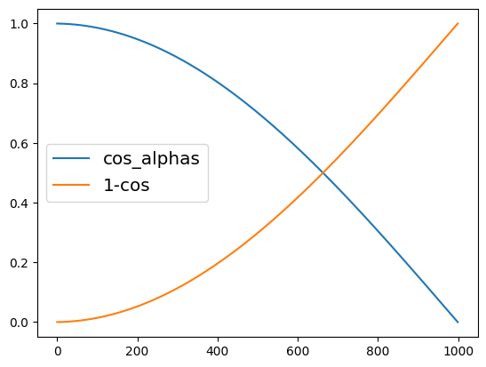

# Diffusers

Diffusers is a library of state-of-the-art pretrained diffusion models for generating videos, images, and audio.

`Diffusers` 是最牛逼的预训练扩散模型库，可生成视频、图片和音频。

## 核心 API

主要有 3 部分：Pipelines、Models、Schedulers。复杂的扩散模型被拆成 3 个可以独立理解、替换和组合的模块。

1. **Pipelines（流水线：胶水代码 / UX 层）**  
   把模型、调度器、文本编码器、VAE 等**粘在一起**，提供一个**好用的高层接口**。
   本质是编排，而不是新算法。

2. **Models（模型：算子）**  
   真正做数值计算的部分，比如 `UNet2DConditionModel`。

> 给定当前 noisy latent + timestep (+ condition)，预测噪声 / 残差。

3. **Schedulers（调度器：时间积分方法）**  
   用于在推理期间从噪声中生成图像，以及生成用于训练的噪声图像的**各种技术**。不关心网络结构，只定义数学过程。

> timestep 怎么走？
> 每一步怎么从 `x_t` 变到 `x_{t-1}`？

### Pipeline(管道)

```py
# 准备工作
import numpy as np
import torch
import torch.nn.functional as F
from matplotlib import pyplot as plt
from PIL import Image

def show_images(x):
   """Given a batch of images x, make a grid and convert to PIL"""
   x = x * 0.5 + 0.5  # Map from (-1, 1) back to (0, 1)
   grid = torchvision.utils.make_grid(x)
   grid_im = grid.detach().cpu().permute(1, 2, 0).clip(0, 1) * 255
   grid_im = Image.fromarray(np.array(grid_im).astype(np.uint8))
   return grid_im

def make_grid(images, size=64):
   """Given a list of PIL images, stack them together into a line for easy viewing"""
   output_im = Image.new("RGB", (size * len(images), size))
   for i, im in enumerate(images):
      output_im.paste(im.resize((size, size)), (i * size, 0))
   return output_im

# 芯片：Mac M1 Pro
device = torch.device("cuda" if torch.cuda.is_available() else "mps")

# 实用pipeline
from diffusers import DDPMPipeline

butterfly_pipeline = DDPMPipeline.from_pretrained("johnowhitaker/ddpm-butterflies-32px").to(device)
images = butterfly_pipeline(batch_size=8).images
make_grid(images)

```

### Model(模型)

大多数扩散模型使用的**模型架构**是 [U-net](https://arxiv.org/abs/1505.04597) 或其变体。


`Diffusers` 提供了开箱即用的 `UNet2DModel` 类，用来创建模型。

```py
from diffusers import UNet2DModel

# Create a model
model = UNet2DModel(
   sample_size=image_size,  # the target image resolution
   in_channels=3,  # the number of input channels, 3 for RGB images
   out_channels=3,  # the number of output channels
   layers_per_block=2,  # how many ResNet layers to use per UNet block
   block_out_channels=(64, 128, 128, 256),  # More channels -> more parameters
   down_block_types=(
      "DownBlock2D",  # a regular ResNet downsampling block
      "DownBlock2D",
      "AttnDownBlock2D",  # a ResNet downsampling block with spatial self-attention
      "AttnDownBlock2D",
   ),
   up_block_types=(
      "AttnUpBlock2D",
      "AttnUpBlock2D",  # a ResNet upsampling block with spatial self-attention
      "UpBlock2D",
      "UpBlock2D",  # a regular ResNet upsampling block
   ),
)
model.to(device)
```

### Scheduler(调度器)

```py
from diffusers import DDPMScheduler

cos_noise_scheduler = DDPMScheduler(num_train_timesteps=1000, beta_schedule='squaredcos_cap_v2')

plt.plot(cos_noise_scheduler.alphas_cumprod.cpu() ** 0.5, label='cos_alphas')
plt.plot(1 - cos_noise_scheduler.alphas_cumprod.cpu() ** 0.5, label='1-cos')
plt.legend(fontsize='x-large')
```


**第 1 步**时显示纯输入(原始图片)，**中间步**显示两者融合，**第 1000 步**时显示纯噪音。
