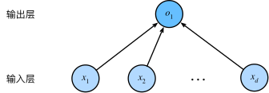
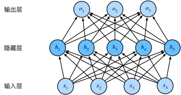
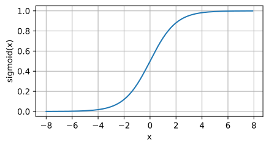
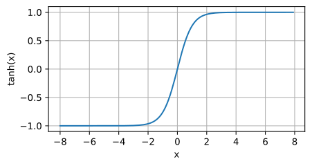

# 深度学习

## 形态

- **欠拟合**：这些曲线之间的差距很小，验证损失从未增加，因此网络拟合不足的可能性比拟合过度的可能性更大。如果真是这样的话，那就值得试验更多的容量。

- **过拟合**：现在，验证损失很早就开始增加，而训练损失继续减少。这表明网络已经开始过度填充。在这一点上，我们需要尝试一些措施来防止它，要么减少单位数量，要么通过提前停止等方法。

- **提前停止**：一旦开始过拟合，早期停止回调确实停止了训练。此外，通过包括 `restore_best_weights`，我们仍然可以将模型保持在验证损失最低的位置。

## 仿射变换

仿射变换（`affine transformation`），特点是通过`加权`和对特征进行`线性变换`（linear transformation）， 并通过`偏置项`来进行平移（`translation`）。

## 从线性回归到深度网络



线性回归是一个**单层神经网络**，层数为 1。我们可以将线性回归模型视为仅由单个人工神经元组成的神经网络，或称为单层神经网络。

对于线性回归，每个输入都与每个输出（在本例中只有一个输出）相连，称为全连接层（fully-connected layer）或称为稠密层（dense layer）。

## 多层感知机

线性意味着单调假设，可能会出错。我们可以通过在网络中加入一个或多个**隐藏层**来克服线性模型的限制， 使其能处理更普遍的函数关系类型。对于深度神经网络，我们使用观测数据来联合学习隐藏层表示和应用于该表示的线性预测器。



我们可以通过在网络中加入一个或多个隐藏层来克服线性模型的限制， 使其能处理更普遍的函数关系类型。 要做到这一点，最简单的方法是将许多全连接层堆叠在一起。 每一层都输出到上面的层，直到生成最后的输出。 我们可以把前层看作表示，把最后一层看作线性预测器。 这种架构通常称为多层感知机（`multilayer perceptron`），通常缩写为`MLP`。

为了发挥多层架构的潜力，我们还需要一个额外的关键要素：在仿射变换之后对每个隐藏单元应用**非线性**的**激活函数（activation function）**。激活函数的输出被称为活性值（activations）。一般来说，有了激活函数，就不可能再将我们的多层感知机退化成线性模型。

### 激活函数

激活函数（`activation function`）通过计算加权和并加上偏置来确定神经元是否应该被激活， 它们将输入信号转换为输出的可微运算。

#### ReLU

最受欢迎的激活函数是修正线性单元（`Rectified linear unit`，**ReLU**），因为它实现简单，同时在各种预测任务中表现良好。ReLU 提供了一种非常简单的非线性变换。

给定元素`x`，`ReLU`函数被定义为该元素与 0 的最大值：`ReLU(x) = max(x, 0)`。

```python
import torch
from d2l import torch as d2l

x = torch.arange(-8.0, 8.0, 0.5, requires_grad=True)
y = torch.relu(x)
d2l.plot(x.detach(), y.detach(), 'x', 'relu(x)', figsize=(5, 2.5))
```


#### sigmoid

对于一个定义域在 `R` 中的输入， `sigmoid` 函数将输入变换为区间(0, 1)上的输出。 `因此，sigmoid` 通常称为**挤压函数（squashing function）**: 它将范围`（-inf, inf）`中的任意输入压缩到区间`（0, 1）`中的某个值。

在最早的神经网络中，科学家们感兴趣的是对“激发”或“不激发”的生物神经元进行建模。 因此，这一领域的先驱可以一直追溯到人工神经元的发明者麦卡洛克和皮茨，他们专注于阈值单元。 阈值单元在其输入低于某个阈值时取值 0，当输入超过阈值时取值 1。

当我们想要将输出视作二元分类问题的概率时， sigmoid 仍然被广泛用作输出单元上的激活函数，后面关于循环神经网络的章节中，我们将描述利用 sigmoid 单元来控制时序信息流的架构。

当输入接近 0 时，sigmoid 函数接近线性变换。（`sigmoid` 可以视为 `softmax` 的特例）

```python
y = torch.sigmoid(x)
d2l.plot(x.detach(), y.detach(), 'x', 'sigmoid(x)', figsize=(5, 2.5))
```



#### tanh

与 `sigmoid` 函数类似，`tanh(双曲正切)`函数也能将其输入压缩转换到区间`(-1, 1)`上。当输入在 0 附近时，tanh 函数接近线性变换。 函数的形状类似于 sigmoid 函数， 不同的是 tanh 函数关于坐标系原点中心对称。

```python
y = torch.tanh(x)
d2l.plot(x.detach(), y.detach(), 'x', 'tanh(x)', figsize=(5, 2.5))
```



### 向前传播

前向传播（`forward propagation 或 forward pass`） 指的是：按**顺序**（从输入层到输出层）**计算和存储**神经网络中每层的**结果**。

### 反向传播

反向传播（`backward propagation 或 backpropagation`）指的是计算神经网络参数**梯度**的方法。 简言之，该方法根据**微积分**中的链式规则，按**相反的顺序**从输出层到输入层遍历网络。 该算法存储了计算某些参数梯度时所需的**任何中间变量（偏导数）**。

### 训练神经网络

因此，在训练神经网络时，在初始化模型参数后， 我们**交替使用**前向传播和反向传播，利用反向传播给出的梯度来更新模型参数。 注意，反向传播重复利用前向传播中存储的中间值，以避免重复计算。 带来的影响之一是我们需要保留中间值，直到反向传播完成。 这也是训练比单纯的预测需要更多的内存（显存）的原因之一。 此外，这些中间值的大小与网络层的数量和批量的大小大致成正比。 因此，使用更大的批量来训练更深层次的网络更容易导致内存不足（`out of memory`）错误。

### 小结

- 前向传播在神经网络定义的计算图中按顺序计算和存储中间变量，顺序是从输入层到输出层。
- 反向传播按相反顺序（从输出层到输入层），计算和存储中间变量和参数的梯度。
- 在训练深度学习模型时，前向传播和反向传播是相互依赖的。
- 训练比预测需要更多的内存。
