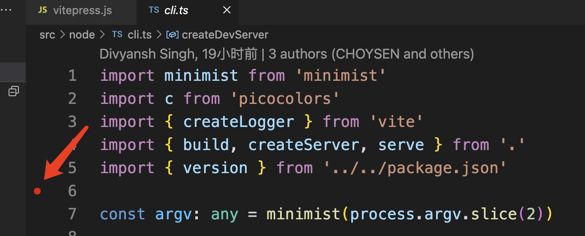
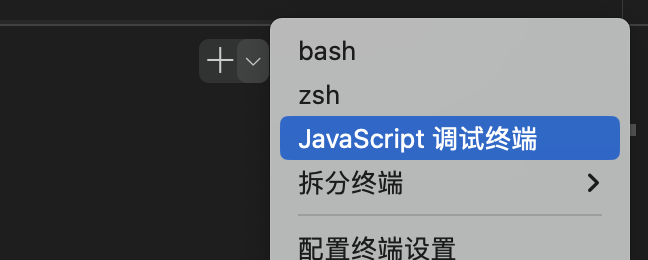
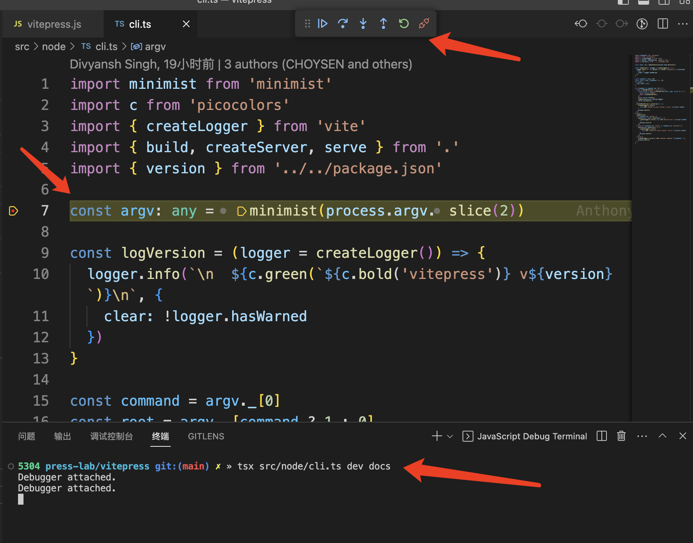

# tsx 执行 ts 文件，VSCode 调试 ts 文件

众所周知，Node.js 并不支持直接执行 TS 文件，一般借助第三方才能执行。如之前的 ts-node，现在的 tsx。

tsx：`TypeScript Execute` 的缩写，出自 [esbuild](https://github.com/esbuild-kit) 门下。

【[Github 库地址](https://github.com/esbuild-kit/tsx)】

## tsx 安装与使用

### 全局安装

```bash
npm install -g tsx
# 用法
tsx index.ts
```

### 局部安装

```bash
npm install --save-dev tsx
```

在 package.json 中用

```json
{
  "scripts": {
    "dev": "tsx ..."
  }
}
```

运行**二进制可执行文件**时，需要 [npx](/node/npx) 调用

```bash
npx tsx ...
```

## VSCode 调试 ts 文件

### 1、标注断点位置



### 2、命令行切换到 JavaScript 调试终端



### 3、输入调试命令，开调！

由于我是全局安装 tsx，直接输入命令 `tsx src/node/cli.ts dev docs`，开调！

