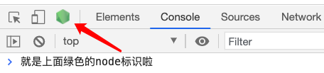
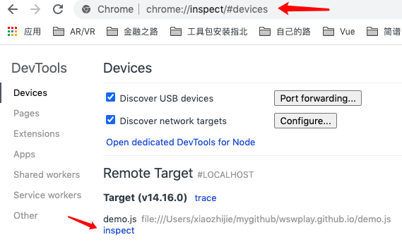
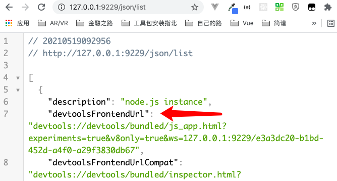

# More Debugging，Less Bugs。

**调试**，是开发、学习、借鉴的第一步。  
是前进的阶梯，是更上一层楼的敲门砖。——鲁迅没说过这话:laughing:

## 本地调试 Nodejs(浏览器)

### --inspect-brk

**1. 使用 --inspect-brk=host:port 标志启动远端服务器内的 inspector 调试器**

```bash
node --inspect-brk xxx.js
```

命令行，会出现如下信息

```bash
Debugger listening on ws://127.0.0.1:9229/a06e74fe-603d-4c6c-8609-4a4128968ed9
For help, see: https://nodejs.org/en/docs/inspector
```

这是启用了 V8 检查器，启动了一个 ws 服务，默认端口 9229，加一个动态生成的 UUID, 这时需要一个可以连接该服务的调试客户端。打开 chrome 的开发者工具页面，如果看到 node 的绿色图标，点击就可进入调试。  
  
:::tip
如果没有，在 chrome 的地址栏输入 `chrome://inspect/#devices`  
可以看到如下图所示，Remote Target 中会有你启动调试的文件，点击 inspect
:::


如果是自定义端口，则点击上图中`Discover network targets`右侧按钮，添加上你的端口即可。

**或者用另外一种方式打开调试界面**  
**2. 在本地访问 `http://[host:port]/json/list` 得到 `devtoolsFrontendUrl`。**  
**3. 本地访问 `devtoolsFrontendUrl` 得到调试界面。**



### Vitepress 的 debug 命令

```json
{
  "docs-debug": "node --inspect-brk ./bin/vitepress dev docs"
}
```
